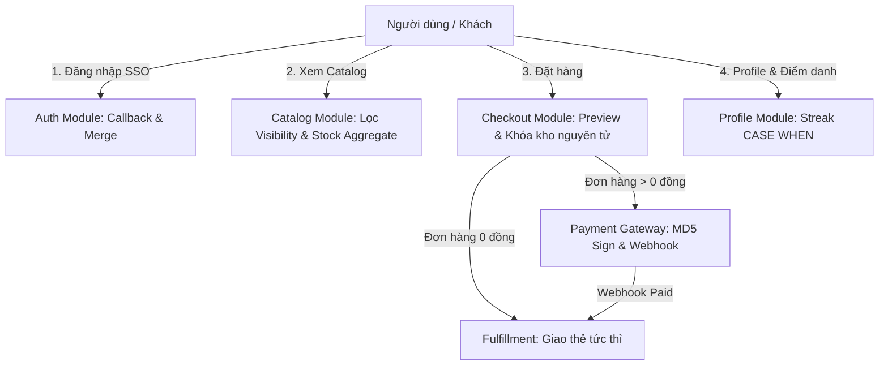
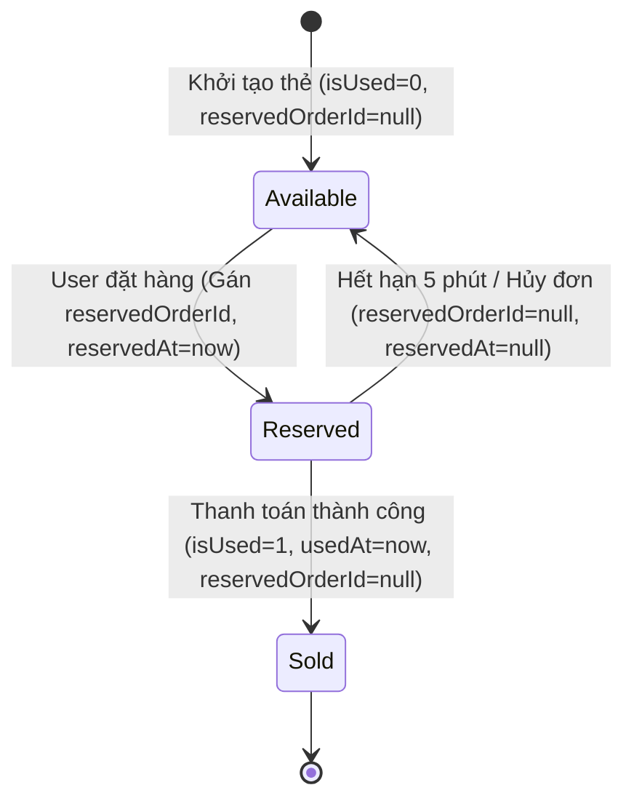
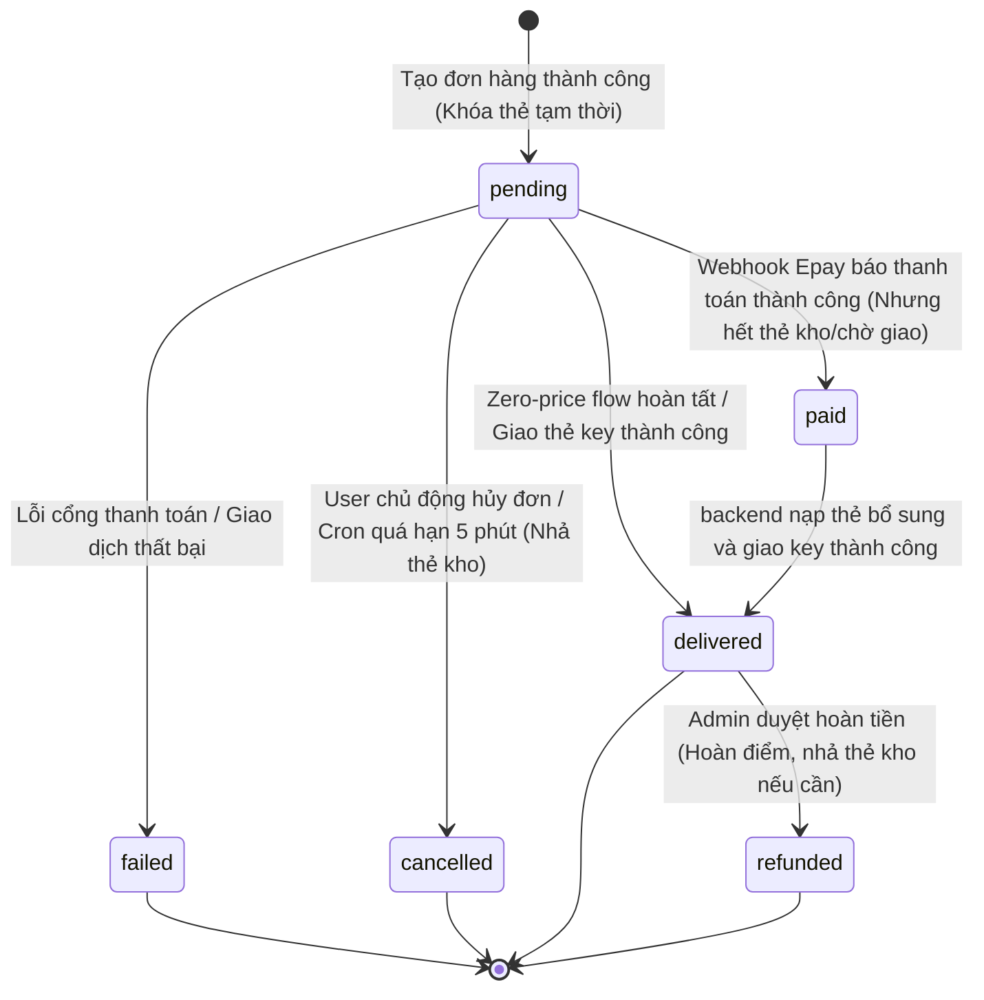

# Domain Business Rules (Quy Tắc Nghiệp Vụ Cốt Lõi)

Tài liệu này đặc tả toàn bộ các quy tắc nghiệp vụ (Business Rules), luồng logic xử lý, edge cases, hằng số hệ thống, thuật toán, và các điều kiện ràng buộc trong Grip Store được bóc tách trực tiếp từ mã nguồn thực tế. Đây là tài liệu tối quan trọng để Backend Team lập trình chính xác các chức năng nghiệp vụ trên môi trường mới.

---

## 🗺️ Sơ đồ Kiến trúc luồng nghiệp vụ tổng quan



---

## 📦 1. Stock Logic (Nghiệp vụ Quản lý tồn kho)

### 1.1 Cơ chế Giữ thẻ tạm thời (Stock Reservation Flow)
- **Hằng số giữ hàng:** `RESERVATION_TTL_MS = 300,000` (5 phút).
- **Mục đích:** Khi người dùng bấm mua thẻ, hệ thống cần tạm thời "khóa" số lượng thẻ tương ứng để tránh tình trạng người khác mua mất trong thời gian chờ thanh toán qua gateway.
- **Trực quan hóa luồng di chuyển trạng thái thẻ kho (Card Stock State):**

- **Công thức xác định thẻ khả dụng (Available Card):**
  Một thẻ trong bảng `cards` được coi là khả dụng nếu nó thỏa mãn đồng thời:
  1. Chưa được bán: `isUsed = 0` (hoặc `null`/`false`).
  2. Chưa bị giữ, hoặc thời hạn giữ đã quá hạn 5 phút:
     $$\text{reservedOrderId} \text{ IS NULL} \quad \mathbf{OR} \quad \text{reservedAt} < (\text{now} - \text{RESERVATION\_TTL\_MS})$$
  3. Thẻ còn hạn sử dụng:
     $$\text{expiresAt} \text{ IS NULL} \quad \mathbf{OR} \quad \text{expiresAt} > \text{now}$$

- **Thuật toán Khóa kho & Dự phòng thẻ ảo (Reservation Mechanics):**
  Khi người dùng thực hiện order với số lượng $Q$ (`quantity`), hệ thống thực hiện vòng lặp $Q$ lần để gán từng thẻ kho cho order thông qua hai phương pháp tuần tự:
  - **Phương pháp A (Atomic Grab):** Thực thi một câu lệnh SQLite nguyên tử đơn lẻ kết hợp `RETURNING id, card_key` nhằm tránh tranh chấp (race condition):
    ```sql
    UPDATE cards
    SET reserved_order_id = ?, reserved_at = ?
    WHERE id = (
        SELECT id FROM cards
        WHERE product_id = ?
          AND (is_used = 0 OR is_used IS NULL)
          AND reserved_at IS NULL
          AND (expires_at IS NULL OR expires_at > ?)
        LIMIT 1
    )
    RETURNING id, card_key
    ```
  - **Phương pháp B (Expired Fallback):** Nếu không còn thẻ trống hoàn toàn, hệ thống quét các thẻ đang bị giữ quá hạn 5 phút bởi một đơn hàng khác (`candidateOrderId`).
    - Trước khi "cướp" thẻ này, backend gọi API cổng thanh toán `queryOrderStatus(candidateOrderId)` để kiểm tra trạng thái đơn cũ.
    - Nếu đơn hàng cũ **đã được thanh toán** (`status = 1`), backend tiến hành giao thẻ đó cho đơn cũ (chuyển đơn cũ thành `paid` và thẻ thành `isUsed = 1`) và tiếp tục tìm kiếm thẻ khác.
    - Nếu đơn hàng cũ **chưa thanh toán**, backend thực hiện cập nhật ghi đè an toàn (steal) thẻ đó cho order hiện tại:
      ```sql
      UPDATE cards
      SET reserved_order_id = :currentOrderId, reserved_at = :now
      WHERE id = :candidateCardId
        AND (is_used = 0 OR is_used IS NULL)
        AND reserved_at < :fiveMinutesAgo
        AND reserved_order_id = :candidateOrderId
      ```

### 1.2 Logic xử lý Thẻ dùng chung (Shared Product)
- **Đặc trưng:** Nếu sản phẩm có cấu hình `products.isShared = 1` (ví dụ: tài khoản dùng chung, mã giảm giá chung sử dụng nhiều lần).
- **Quy tắc vô hạn kho:**
  - Chỉ cần trong DB tồn tại **ít nhất 1 thẻ khả dụng** của sản phẩm đó, tồn kho của sản phẩm sẽ được coi là vô hạn: `INFINITE_STOCK = 999999`.
  - **Tuyệt đối không áp dụng cơ chế khóa thẻ (Reservation)** cho sản phẩm Shared Product khi đặt hàng để tránh lock thẻ vô nghĩa.
  - Khi thanh toán/giao hàng thành công (kể cả luồng 0 đồng), hệ thống lấy ngẫu nhiên 1 thẻ dùng chung để gán nội dung `cardKey` cho đơn hàng (`orders.cardKey`), sao chép key này lặp lại $Q$ lần tương ứng số lượng mua, gán ID của thẻ dùng chung này vào `orders.cardIds`, nhưng **không cập nhật trường `isUsed = 1`** của thẻ đó trong DB, để thẻ tiếp tục được bán cho các đơn hàng sau.
  - Trường hợp đặc biệt: Nếu không tồn tại bất kỳ thẻ dùng chung nào khả dụng của sản phẩm đó trong database, trạng thái đơn hàng sẽ chuyển thành `paid` (đã thanh toán nhưng chờ nạp kho) thay vì `delivered` để admin xử lý thủ công.

---

## 🪙 2. Points & Discount Logic (Nghiệp vụ Điểm thưởng)

### 2.1 Tỷ lệ quy đổi điểm thưởng
- **Hằng số quy đổi:** $1 \text{ Point} = 1 \text{ Đơn vị tiền tệ}$ (VND/Credit).

### 2.2 Thuật toán áp dụng giảm giá bằng điểm (Points Cap Formula)
Khi người dùng chọn sử dụng điểm thưởng để giảm giá đơn hàng, số điểm tối đa có thể áp dụng được tính toán nghiêm ngặt tại server theo công thức:
$$\text{pointsToUse} = \min\Big(\text{userPoints}, \lceil\text{totalAmount}\rceil\Big)$$
Giá trị thanh toán cuối cùng qua cổng thanh toán:
$$\text{finalAmount} = \max\Big(0, \text{totalAmount} - \text{pointsToUse}\Big)$$

- **Bẫy tiềm ẩn (Edge Case - Làm tròn số):** Sử dụng hàm làm tròn lên $\lceil\text{ceil}\rceil$ đối với tổng tiền trước khi so khớp với số điểm thưởng khả dụng để đảm bảo đơn hàng có thể được giảm giá 100% về 0 đồng ngay cả khi tổng tiền có chứa số lẻ thập phân.

### 2.3 Luồng đơn hàng 0 đồng (Zero-Price Flow)
- **Điều kiện:** Nếu sau khi áp dụng giảm giá bằng điểm, `finalAmount <= 0`.
- **Quy tắc bỏ qua thanh toán:**
  - Hệ thống bỏ qua bước tạo link nạp tiền và bỏ qua việc chuyển tiếp tới Epay Gateway.
  - Tiến hành trừ điểm thưởng của user ngay lập tức dưới dạng atomic guard:
    ```sql
    UPDATE login_users
    SET points = points - :pointsToUse
    WHERE user_id = :userId AND points >= :pointsToUse
    ```
    Nếu không có bản ghi nào được update (do số dư thực tế thay đổi bất ngờ), backend ném lỗi `insufficient_points` và chặn đứng quy trình.
  - Chuyển trạng thái đơn hàng ngay lập tức sang `delivered`, gán `tradeNo = 'POINTS_REDEMPTION'`.
  - Đánh dấu thẻ kho tương ứng là đã bán (`isUsed = 1`, `usedAt = now()`, `reservedOrderId = null`, `reservedAt = null`) và hiển thị code thẻ cho khách.
  - Tự động kích hoạt luồng **tự động nạp thẻ từ API đối tác** (`autoReplenishByApi`) để bổ sung kho nếu sản phẩm là thẻ thường.
  - Gửi email thông báo chứa code thẻ tới email khách hàng và gửi thông báo hệ thống (Telegram/Bark) cho admin về giao dịch điểm thưởng.

- **Cơ chế Rollback Điểm:** Nếu việc trừ điểm thành công nhưng thao tác tạo bản ghi đơn hàng (`orders`) tiếp theo đó gặp lỗi, hệ thống phải tự động hoàn lại số điểm đã trừ (`points = points + pointsToUse`) trước khi ném lỗi ra ngoài.

### 2.4 Quy tắc hoàn điểm (Points Refund Invariant)
- **Điều kiện:** Khi một đơn hàng đã thanh toán bằng điểm bị hủy bỏ hoặc hoàn tiền bởi Admin (`markOrderRefunded`).
- **Quy tắc hoàn trả:** Hệ thống bắt buộc phải hoàn trả lại đầy đủ $100\%$ số điểm tích lũy đã dùng (`orders.pointsUsed`) cộng ngược vào số dư tài khoản của khách hàng.
- **Giải phóng kho thẻ khi hoàn tiền:**
  - Nếu cấu hình hệ thống `refund_reclaim_cards` là `true` (mặc định) và sản phẩm không phải Shared Product:
    - Tìm danh sách ID thẻ đã bán qua trường `orders.cardIds` (chuỗi số cách nhau bằng dấu phẩy) hoặc lọc theo `cardKey` và chuyển toàn bộ các thẻ này về trạng thái tự do khả dụng (`isUsed = 0, usedAt = null, reservedOrderId = null, reservedAt = null`).
    - Recalculate lại tồn kho sản phẩm để cập nhật tức thời ra trang Catalog.

---

## 🔄 3. Order Status State Machine (Luồng trạng thái đơn hàng)

Hệ thống quản lý trạng thái đơn hàng (`orders.status`) thông qua mô hình máy trạng thái (State Machine) chặt chẽ:



- **Mô tả ý nghĩa trạng thái nghiệp vụ:**
  - `pending`: Đơn hàng vừa khởi tạo, đang khóa thẻ kho chờ khách thanh toán.
  - `paid`: Đã nhận tiền từ cổng thanh toán thành công nhưng chưa cấp mã key (thường do lỗi nghẽn kho thẻ).
  - `delivered`: Đã thanh toán và đã giao mã key thẻ ảo thành công cho user.
  - `cancelled`: Đơn hàng bị hủy (do hết hạn 5 phút hoặc user bấm hủy).
  - `refunded`: Admin hoàn tiền đơn hàng.
  - `failed`: Giao dịch thanh toán thất bại tại cổng gateway.

- **Quy tắc mapping nhãn và màu sắc (Dumb Frontend Requirement):**
  Frontend hoàn toàn không tự dịch trạng thái hoặc tô màu. Backend tự động biên dịch trạng thái DB sang object JSON chứa `statusText` (nhãn tiếng Việt) và `statusColor` (mã màu CSS) như sau:
  - `pending` $\rightarrow$ Nhãn: `Chờ thanh toán`, Màu: `orange`
  - `paid` $\rightarrow$ Nhãn: `Đang xử lý (Đã thanh toán)`, Màu: `blue`
  - `delivered` $\rightarrow$ Nhãn: `Đã giao hàng`, Màu: `green`
  - `cancelled` $\rightarrow$ Nhãn: `Đã hủy`, Màu: `red`
  - `refunded` $\rightarrow$ Nhãn: `Đã hoàn tiền`, Màu: `purple`
  - `failed` $\rightarrow$ Nhãn: `Thất bại`, Màu: `red`

---

## 👁️ 4. Visibility Level & Trust Level Rules (Quyền xem sản phẩm)

Quy tắc hiển thị sản phẩm tại Catalog được phân quyền động theo cấp độ uy tín (`trustLevel`) của user, tránh việc rò rỉ các sản phẩm nhạy cảm hoặc chống mua đầu cơ:

- **Giải thuật tính toán ngưỡng truy cập (resolveVisibilityThreshold):**
  - Nếu người dùng chưa đăng nhập (`!isLoggedIn`): Ngưỡng truy cập mặc định là `-1`.
  - Nếu người dùng đã đăng nhập: Ngưỡng truy cập là $\max(0, \text{user.trustLevel} \text{ || } 0)$.
- **Logic lọc Query an toàn tại database (visibilityCondition):**
  Backend lọc tất cả danh sách sản phẩm hiển thị trên trang chủ và tìm kiếm theo điều kiện:
  ```sql
  WHERE is_active = 1 AND COALESCE(visibility_level, -1) <= :threshold
  ```
- **Quy tắc bảo mật API:** Nếu khách hàng cố tình gọi trực tiếp API chi tiết sản phẩm `/api/catalog/products/:id` của sản phẩm có `visibilityLevel` cao hơn ngưỡng truy cập của họ, backend phải trả về lỗi `403 Forbidden` ngay lập tức, không được phép rò rỉ bất kỳ thông tin nào của sản phẩm.

---

## 🚫 5. Purchase Limit Check (Giới hạn mua sắm tối đa)

Nhằm chống tình trạng spam, gom hàng hoặc đầu cơ thẻ, hệ thống áp dụng logic kiểm tra giới hạn mua sắm tối đa cho từng sản phẩm:

- **Ràng buộc:** Nếu sản phẩm có cấu hình thuộc tính `purchaseLimit > 0`.
- **Phạm vi kiểm tra đối tượng (Scoping):**
  Backend gom nhóm lịch sử mua hàng của user dựa theo đồng thời:
  1. Mã định danh `userId` của tài khoản đang đăng nhập.
  2. Địa chỉ `email` nhận hàng được nhập tại form checkout.
- **Thuật toán kiểm tra giới hạn mua:**
  Trước khi tạo đơn hàng mới, backend chạy câu lệnh đếm tổng số lượng đã mua khả dụng:
  ```sql
  SELECT COALESCE(SUM(quantity), COUNT(*)) AS totalQuantity
  FROM orders
  WHERE product_id = :productId
    AND (user_id = :currentUserId OR email = :currentUserEmail)
    AND status IN ('paid', 'delivered')
  ```
  Nếu:
  $$\text{totalBought} + \text{quantity\_chuẩn\_bị\_mua} > \text{purchaseLimit}$$
  Backend lập tức chặn giao dịch và trả về lỗi `buy.limitExceeded`.

---

## 🆔 6. Auth User ID Conventions & Merger Rules (Quy ước định danh)

### 6.1 Quy chuẩn cấu trúc User ID
Hệ thống tích hợp hai OAuth Providers và lưu định danh user ID vào bảng `login_users.userId` theo quy chuẩn:
- **LinuxDO:** Chuỗi ký tự số nguyên bản (ví dụ: `1042`).
- **GitHub:** Chuỗi số nguyên được chuẩn hóa và thêm tiền tố `github:` (ví dụ: `github:12345678`).
- **GitHub Username:** Được tự động thêm tiền tố `gh_` (ví dụ: `gh_octocat`) và chuyển sang chữ thường (lowercase) để tránh xung đột với tài khoản LinuxDO trùng tên.

### 6.2 Quy tắc hợp nhất tài khoản (Merge Account Rules)
Khi người dùng đăng nhập bằng GitHub, nếu phát hiện `username` hoặc `email` đã tồn tại trên database dưới dạng tài khoản LinuxDO cũ (hoặc tài khoản Github cũ có ID cũ), backend sẽ tự động thực hiện **hợp nhất tài khoản (Merge Account)** theo quy trình 10 bước nghiêm ngặt để bảo toàn dữ liệu giao dịch:

1. **Thu thập dữ liệu nguồn (Source - cũ) và đích (Target - mới):** Lấy thông tin points, isBlocked, desktopNotifications, createdAt, lastLoginAt của hai bản ghi.
2. **Khởi tạo/Cập nhật bản ghi Target:**
   - Nếu bản ghi Target (`github:{id}`) chưa có trong DB: Tiến hành INSERT bản ghi mới kế thừa toàn bộ điểm thưởng, cấu hình thông báo, trạng thái chặn, và mốc thời gian cũ.
   - Nếu bản ghi Target đã tồn tại: Tiến hành cập nhật gộp:
     - Điểm thưởng gộp: `points = target.points + source.points`.
     - Blocked gộp: `isBlocked = target.isBlocked OR source.isBlocked`.
     - Quyền thông báo gộp: `desktopNotificationsEnabled = target.desktopNotificationsEnabled OR source.desktopNotificationsEnabled`.
     - Thời gian tạo: Lấy mốc nhỏ nhất `min(source.createdAt, target.createdAt)`.
     - Thời gian đăng nhập cuối: Lấy mốc lớn nhất `max(source.lastLoginAt, target.lastLoginAt)`.
3. **Dọn dẹp bản ghi trùng lặp (Unique Constraint Cleansing):** 
   - Xóa các bản ghi trùng lặp trong bảng trung gian `broadcast_reads` của tài khoản source để tránh vi phạm khóa chính khi migrate.
   - Xóa các bản ghi trùng lặp trong bảng `wishlist_votes` của tài khoản source.
4. **Hợp nhất lịch sử giao dịch & Nghiệp vụ:** Chuyển đổi toàn bộ khóa `user_id` từ `sourceUserId` sang `targetUserId` trên các bảng:
   - `orders`, `reviews`, `refund_requests`, `daily_checkins_v2`, `user_notifications`, `user_messages`, `broadcast_reads`, `wishlist_votes`, `wishlist_items`, và `admin_messages.target_value`.
5. **Cập nhật Username đồng bộ:**
   - Chạy lệnh cập nhật trường `username = normalizedNewUsername` trong các bảng nghiệp vụ liên quan (`orders`, `reviews`, `refund_requests`, `user_messages`, `wishlist_items`) nơi user_id đã chuyển sang Target ID, để đảm bảo tính nhất quán dữ liệu hiển thị.
6. **Xóa tài khoản Source cũ:** Chạy câu lệnh `DELETE FROM login_users WHERE user_id = :sourceUserId` để hoàn tất tiến trình giải phóng tài khoản rác.

---

## 👤 7. Daily Check-in Streak & Timezone (Điểm danh hàng ngày)

### 7.1 Điều kiện cấu hình
- Cờ kích hoạt: Phải kiểm tra cấu hình hệ thống `checkin_enabled` (trong bảng `settings`). Nếu bằng `'false'`, chặn điểm danh và báo lỗi `Check-in is currently disabled`.
- Điểm thưởng: Lấy cấu hình `checkin_reward` từ database, nếu không có mặc định thưởng là `10` points.

### 7.2 Thuật toán tính chuỗi streak liên tục (Consecutive Streak Invariants)
- Mốc thời gian điểm danh được quy đổi chuẩn mực về UTC Start of Day để tránh chênh lệch múi giờ giữa client và server:
  - **todayStartUtcMs:** Lấy giờ UTC bắt đầu của ngày hiện tại:
    $$\text{todayStartUtcMs} = \text{Date.UTC}(\text{now.getUTCFullYear}(), \text{now.getUTCMonth}(), \text{now.getUTCDate}())$$
  - **yesterdayStartUtcMs:** Lấy giờ UTC bắt đầu của ngày hôm qua:
    $$\text{yesterdayStartUtcMs} = \text{todayStartUtcMs} - 86,400,000 \text{ ms}$$

- **Hành động Cập nhật Nguyên tử (Atomic Check-in):**
  Để ngăn chặn tình trạng bấm đúp (double click) hoặc race condition, backend thực thi câu lệnh SQL cập nhật điểm và streak đồng bộ có kèm điều kiện chặn kép:
  - **Điều kiện WHERE:** Chỉ thực hiện nếu `lastCheckinAt` chưa có hoặc nhỏ hơn `todayStartUtcMs` (tức là hôm nay chưa điểm danh).
  - **Biểu thức tính toán Streak:** Sử dụng `CASE WHEN` trực tiếp trong SQL:
    ```sql
    UPDATE login_users
    SET points = points + :reward,
        last_checkin_at = :nowDate,
        consecutive_days = CASE
            WHEN last_checkin_at IS NOT NULL
             AND last_checkin_at >= :yesterdayStartUtcMs
             AND last_checkin_at < :todayStartUtcMs
            THEN COALESCE(consecutive_days, 0) + 1
            ELSE 1
        END
    WHERE user_id = :userId
      AND (last_checkin_at IS NULL OR last_checkin_at < :todayStartUtcMs)
    ```
  - Nếu số bản ghi cập nhật được trả về bằng 0, backend trả lỗi `Already checked in today`.

---

## 🌟 8. Wishlist & Reviews Logic (Sản phẩm mong ước & Đánh giá)

### 8.1 Logic xử lý Wishlist (Sản phẩm mong ước)
- **Tương tác Upvote/Downvote (Toggle Vote):**
  - Yêu cầu user đăng nhập, kiểm tra trạng thái bị chặn `isBlocked`.
  - Kiểm tra cài đặt hệ thống `wishlist_enabled` phải là `'true'`.
  - Thực hiện cơ chế toggle vote: Kiểm tra sự tồn tại của bản ghi `{ item_id, user_id }` trong bảng `wishlist_votes`.
    - Nếu đã vote: Tiến hành DELETE bản ghi vote.
    - Nếu chưa vote: Tiến hành INSERT bản ghi vote mới (`INSERT OR IGNORE` để tránh lỗi khóa duy nhất).
  - Trả về kết quả vote mới (`voted: true/false`) kèm theo tổng số vote hiện tại (`count`) của item đó.

### 8.2 Logic Đánh giá sản phẩm (Review Constraints)
- **Ràng buộc bảo mật viết đánh giá (submitReview):**
  Để chống spam đánh giá ảo, backend kiểm tra các điều kiện nghiêm ngặt:
  1. Rating phải nằm trong khoảng từ `1` đến `5` sao.
  2. User bắt buộc phải là người sở hữu đơn hàng (`userId === session.user.id` hoặc `username === session.username`).
  3. Đơn hàng tương ứng phải ở trạng thái `delivered` (đã nhận hàng thành công).
  4. Đơn hàng đó chưa từng được dùng để đánh giá trước đây (đảm bảo mỗi đơn hàng chỉ được review 1 lần duy nhất).
- **Quy trình đồng bộ chỉ số sản phẩm (Rating Cache Recalculation):**
  Khi có đánh giá mới hợp lệ, backend chạy tiến trình bất đồng bộ recalculate chỉ số sản phẩm để đồng bộ trực tiếp vào 2 trường aggregate cache trên bảng `products`:
  - `rating`: Trung bình cộng của tất cả điểm review (`AVG(rating)`).
  - `reviewCount`: Tổng số lượng đánh giá (`COUNT(*)`).

---

## 🔔 9. Notifications & Broadcasting System (Thông báo & Phát sóng)

Hệ thống thông báo gộp hai nguồn dữ liệu khác nhau để tạo ra một Hộp thư hợp nhất (**Unified Inbox**) gửi về Dumb Frontend:

### 9.1 Phân loại nguồn thông báo
1. **Thông báo cá nhân (user_notifications):** Gửi riêng cho từng user cụ thể (ví dụ: giao hàng thành công, hoàn tiền).
2. **Thông báo phát sóng (broadcast_messages):** Do admin gửi chung cho toàn bộ hệ thống (ví dụ: bảo trì, thông báo chung).

### 9.2 Luồng xử lý Broadcast & Đánh dấu đã đọc
- Để theo dõi xem user đã đọc thông báo phát sóng hệ thống chưa, hệ thống sử dụng bảng `broadcast_reads`.
- **Thuật toán tính số lượng chưa đọc (getMyUnreadCount):**
  $$\text{unreadCount} = \text{userUnreadNotifications} + \max\Big(0, \text{broadcastCount} - \text{readBroadcastCount}\Big)$$
  - Trong đó, hệ thống chỉ kiểm tra tối đa `BROADCAST_LIMIT = 10` thông báo phát sóng mới nhất.
  - Lọc bỏ các thông báo phát sóng được tạo trước mốc thời gian dọn dẹp thông báo cuối cùng của user (`broadcast_cleared_at:{userId}`).

### 9.3 Logic dọn dẹp thông báo (clearMyNotifications)
Khi người dùng bấm xóa sạch thông báo:
1. Xóa toàn bộ các thông báo cá nhân (`user_notifications`) của user này trong DB.
2. Ghi nhận mốc thời gian dọn dẹp hiện tại vào cấu hình `broadcast_cleared_at:{userId}` của user.
3. Chèn các bản ghi đánh dấu đã đọc (`INSERT OR IGNORE`) cho toàn bộ thông báo phát sóng hiện hữu của hệ thống trong bảng `broadcast_reads` dưới tên user này để ẩn chúng đi hoàn toàn.

---

## 👑 10. Admin Configs & Security Conventions (Cài đặt Admin)

### 10.1 Xác định quyền quản trị (Admin Privilege Verification)
- Quyền Admin được kiểm tra động trực tiếp bằng code:
  - Đọc biến môi trường **`ADMIN_USERS`** (chuỗi phân tách bằng dấu phẩy các username admin, ví dụ: `admin1,admin2,gh_octocat`).
  - So khớp username đăng nhập hiện tại có nằm trong danh sách này hay không (so sánh chữ thường case-insensitive).
  - Mọi API admin bắt buộc phải đi qua middleware này, ném lỗi `Unauthorized` hoặc `403 Forbidden` ngay lập tức nếu vi phạm.

### 10.2 Tác vụ tự động giải phóng thẻ lock quá hạn (Cron Cleanup)
- **Background Cleanup Expired Cards:** 
  Hệ thống chạy ngầm hoặc qua trigger dọn dẹp thẻ ảo hết hạn sử dụng:
  - Quét bảng `cards` tìm các thẻ có `expiresAt < now`.
  - Thực hiện câu lệnh xóa vĩnh viễn: `DELETE FROM cards WHERE expires_at < now`.
  - Recalculate lại toàn bộ số tồn kho aggregate cache của các sản phẩm bị ảnh hưởng.
  - Thao tác này được throttle cách nhau tối thiểu 10 phút thông qua cấu hình setting `cards_expiry_cleanup_at` để bảo vệ hiệu năng DB, ngoại trừ trường hợp check trực tiếp khi productId được chỉ định.
- **Background Cancel Expired Orders:**
  Hệ thống tìm kiếm các đơn hàng ở trạng thái `pending` đã quá hạn thanh toán 5 phút (`createdAt < now - 300,000`).
  - Chuyển trạng thái đơn hàng sang `cancelled`.
  - Giải phóng toàn bộ các thẻ bị giữ liên quan bằng cách reset `reservedOrderId = null, reservedAt = null`.
  - Chạy recalculate aggregate tồn kho để đưa các thẻ này về trạng thái khả dụng ngoài Catalog.

---

## 🗃️ 11. Structured Domain Knowledge Database (bdistill JSONL format)

Dưới đây là cơ sở dữ liệu tri thức dạng JSONL (JSON Lines) được bóc tách tự động bằng công cụ `bdistill` từ codebase thực tế của Grip Store, phân chia chi tiết theo 8 Modules chức năng để làm tài liệu đối chiếu cho Backend Team:

```json
{"question": "Mã nguồn chuẩn hóa định danh GitHub và cơ chế ghép tài khoản (Merge Account) trong hệ thống hoạt động thế nào?", "answer": "Sử dụng hàm 'normalizeGitHubUserId' để chuyển đổi ID GitHub thành dạng 'github:{id}' và hàm 'resolveExistingGitHubUserIdByUsername' để kiểm tra xem username đã có trong bảng 'login_users' chưa. Nếu trùng khớp email/username với một tài khoản cũ (LinuxDO hoặc Github ID cũ), backend thực thi hàm 'migrateLegacyUserId' để cập nhật targetUserId, gộp điểm thưởng, gộp trạng thái chặn, xóa trùng lặp trong 'broadcast_reads' và 'wishlist_votes', sau đó cập nhật đồng loạt user_id và username trên các bảng orders, reviews, refund_requests, daily_checkins_v2, user_notifications, user_messages, broadcast_reads, wishlist_votes, wishlist_items, admin_messages. Cuối cùng, thực hiện xóa bản ghi sourceUserId cũ.", "domain": "grip-store-rules", "category": "auth", "tags": ["oauth", "normalization", "account-merge", "migration"], "quality_score": 0.99, "confidence": 1.0, "validated": true, "source_model": "Gemini 3.5 Flash"}
{"question": "Backend thực thi việc lọc Catalog sản phẩm theo Trust Level và tối ưu tồn kho ảo ra sao?", "answer": "Backend thực hiện lọc an toàn từ database thông qua hàm 'visibilityCondition': Lọc các sản phẩm có 'isActive = 1' và 'visibilityLevel <= threshold' (với threshold = -1 cho khách vãng lai, và threshold = max(0, user.trustLevel) cho người dùng đăng nhập). Nhằm tối ưu hóa tốc độ truy vấn và tránh đếm live chậm từ bảng cards, tồn kho được đọc trực tiếp từ các trường aggregate cache: 'stockCount', 'lockedCount', 'soldCount', 'rating', 'reviewCount' trên bảng 'products'. Các trường này được tính toán đồng bộ lại bất đồng bộ qua hàm 'recalcProductAggregates' khi có thao tác nhập, mua thẻ, hoàn tiền, hoặc ghi đánh giá review.", "domain": "grip-store-rules", "category": "catalog", "tags": ["catalog-filter", "trust-level", "stock-cache", "aggregates"], "quality_score": 0.98, "confidence": 1.0, "validated": true, "source_model": "Gemini 3.5 Flash"}
{"question": "Quy trình giữ thẻ kho nguyên tử (Atomic Stock Reservation) chống race condition hoạt động thế nào trong codebase?", "answer": "Hàm 'createOrder' trong 'src/actions/checkout.ts' thực thi hai phương pháp: Đầu tiên, thử cập nhật giữ thẻ trống nguyên tử (Method A) bằng lệnh UPDATE...WHERE id = (SELECT id FROM cards WHERE...) RETURNING id, card_key. Nếu thất bại, chuyển sang Method B (Expired Fallback): Tìm các thẻ có reservation bị hết hạn (>5 phút), kiểm tra trạng thái đơn hàng của thẻ đó thông qua cổng thanh toán epay. Nếu đơn cũ đã paid, cập nhật thẻ đó là đã bán và order tương ứng là paid. Nếu đơn cũ chưa paid, 'cướp' thẻ đó bằng cách cập nhật reservedOrderId = currentOrderId và reservedAt = now.", "domain": "grip-store-rules", "category": "checkout", "tags": ["stock-reservation", "atomic-lock", "concurrency", "expired-fallback"], "quality_score": 0.99, "confidence": 1.0, "validated": true, "source_model": "Gemini 3.5 Flash"}
{"question": "Bộ phân dịch trạng thái đơn hàng (UI Status Mapper) và cơ chế ẩn khóa thẻ hoạt động thế nào?", "answer": "Để đảm bảo frontend hoàn toàn Dumb Frontend, backend tự động dịch mã trạng thái DB ('pending', 'paid', 'delivered', 'cancelled', 'refunded', 'failed') sang nhãn tiếng Việt hiển thị ('statusText') và màu CSS tương ứng ('statusColor' như green, orange, red, blue, purple) trước khi trả về. Đồng thời, backend gán trường 'cardKey = null' cho tất cả các đơn hàng có trạng thái khác 'delivered' để đảm bảo bảo mật thông tin thẻ ảo tối đa.", "domain": "grip-store-rules", "category": "orders", "tags": ["status-mapping", "card-key-masking", "security"], "quality_score": 0.97, "confidence": 1.0, "validated": true, "source_model": "Gemini 3.5 Flash"}
{"question": "Thuật toán tính điểm danh hàng ngày và chuỗi liên tục (Daily Check-in Streak) xử lý thế nào để chống điểm danh lặp?", "answer": "Quy đổi ngày điểm danh chuẩn mực về UTC start of day bằng cách dùng hàm 'Date.UTC()' cho nowDate. Tính 'todayStartUtcMs' và 'yesterdayStartUtcMs'. Sau đó, thực hiện câu lệnh UPDATE nguyên tử trong bảng 'login_users' kèm theo điều kiện WHERE: 'lastCheckinAt IS NULL OR lastCheckinAt < todayStartUtcMs' để đảm bảo mỗi ngày chỉ điểm danh được 1 lần. Streak được tính toán bằng CASE WHEN: Nếu lastCheckinAt nằm trong khoảng [yesterdayStartUtcMs, todayStartUtcMs), streak tăng lên 1, ngược lại reset về 1.", "domain": "grip-store-rules", "category": "profile", "tags": ["checkin-streak", "gamification", "atomic-points", "timezone-utc"], "quality_score": 0.99, "confidence": 1.0, "validated": true, "source_model": "Gemini 3.5 Flash"}
{"question": "Cơ chế quản lý wishlist và các ràng buộc đánh giá sản phẩm (Review Constraints) hoạt động ra sao?", "answer": "Wishlist votes được toggle bằng cách kiểm tra bản ghi trong bảng 'wishlist_votes'. Nếu có, xóa vote; nếu chưa, INSERT OR IGNORE vote mới, trả về voted trạng thái và tổng số count lượt vote. Ràng buộc review yêu cầu: Rating nằm trong khoảng 1-5, người review là owner của đơn hàng, trạng thái đơn hàng là 'delivered' và đơn hàng này chưa từng được dùng để viết đánh giá trước đó. Khi ghi nhận review mới thành công, hệ thống tự động chạy recalc chỉ số trung bình rating và tổng reviewCount lưu trực tiếp trên bảng products.", "domain": "grip-store-rules", "category": "wishlist-reviews", "tags": ["wishlist-votes", "review-rules", "spam-protection", "rating-recalc"], "quality_score": 0.98, "confidence": 1.0, "validated": true, "source_model": "Gemini 3.5 Flash"}
{"question": "Thuật toán đồng bộ hóa và tính số lượng unread thông báo (Unread Count) hoạt động như thế nào?", "answer": "Số lượng unread được tính bằng tổng: 'personal_unread (isRead = 0)' cộng với số lượng 'broadcast_messages' (giới hạn 10 thông báo mới nhất) được tạo sau mốc thời gian dọn dẹp 'broadcast_cleared_at' của user, mà chưa tồn tại bản ghi đã đọc tương ứng trong bảng 'broadcast_reads'. Khi user bấm clear thông báo, backend xóa thông báo cá nhân, lưu timestamp 'clear' vào settings dưới key 'broadcast_cleared_at:{userId}', và INSERT OR IGNORE bản ghi đã đọc cho tất cả tin nhắn broadcast hiện tại.", "domain": "grip-store-rules", "category": "notifications", "tags": ["unread-count", "unified-inbox", "broadcast-read", "notifications-clear"], "quality_score": 0.99, "confidence": 1.0, "validated": true, "source_model": "Gemini 3.5 Flash"}
{"question": "Cơ chế phân quyền Admin và tác vụ tự động giải phóng thẻ lock quá hạn (Cron Cleanup) chạy ra sao?", "answer": "Quyền admin được xác định bằng cách đọc biến môi trường 'ADMIN_USERS' (comma-separated usernames), bóc tách thành mảng và so khớp case-insensitive với username của session. Tác vụ cleanup expired cards quét bảng 'cards' xóa tất cả các thẻ có 'expiresAt < now' và update cache tồn kho sản phẩm (được throttle 10 phút một lần). Tác vụ cancelExpiredOrders chuyển trạng thái đơn hàng pending quá 5 phút sang 'cancelled', giải phóng reservedOrderId và reservedAt của các thẻ kho tương ứng để nạp lại vào kho khả dụng.", "domain": "grip-store-rules", "category": "admin", "tags": ["admin-authorization", "cron-cleanup", "stock-release", "admin-users-env"], "quality_score": 0.99, "confidence": 1.0, "validated": true, "source_model": "Gemini 3.5 Flash"}
```
