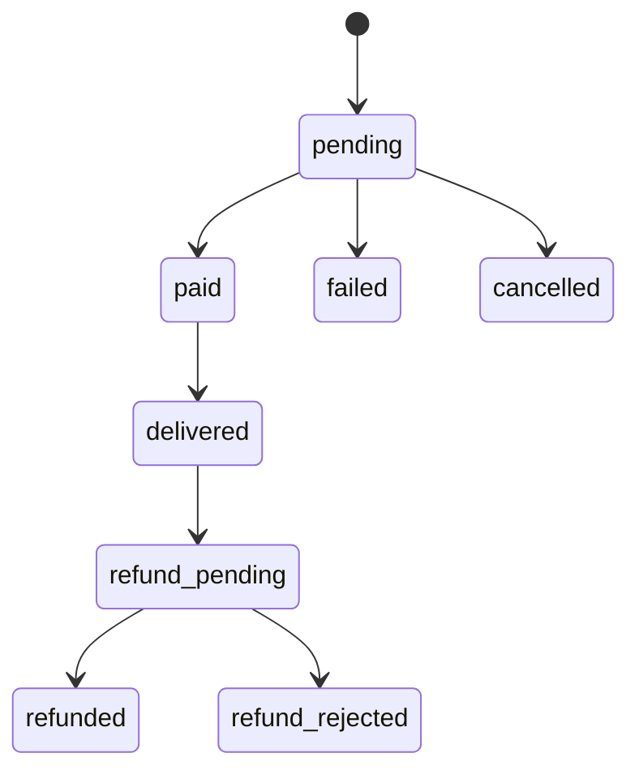

# Grip Store Domain Rules

This document captures the business rules that must survive the frontend-to-REST migration.

## Stock

- `INFINITE_STOCK` is represented by `-1` in frontend-facing DTOs for shared products.
- Reservation uses a time-limited lock (`RESERVATION_TTL`) before payment completes.
- Non-shared products deliver unique card inventory and consume available stock.
- Shared products use a reusable card pool. If at least one valid shared card exists, stock is reported as infinite.
- Cancelled or expired pending orders must release reserved stock.

## Orders

- Status flow:
  - `pending` -> `paid` -> `delivered`
  - `pending` -> `failed`
  - `pending` -> `cancelled`
  - `delivered` -> `refund_pending` -> `refunded` or `refund_rejected`
- Payment callback and webhook processing must be idempotent.
- Each order stores purchase quantity, points used, payment identifier, and delivery timestamps.

## Pricing and Points

- Money is stored and transmitted as strings to avoid precision loss.
- Points operate as a 1:1 currency discount against the order amount.
- Zero-price orders created entirely with points must skip external payment and move directly through fulfillment.
- Refunded orders must return reclaimed points when policy allows.

## Auth and Identity

- OAuth providers are LinuxDO and GitHub.
- LinuxDO users use their numeric/discourse identity directly.
- GitHub identities are namespaced as `github:{id}` to avoid collisions.
- Backend owns OAuth callback handling and token issuance.
- Frontend stores access token plus refresh token and retries once after `401`.

## Visibility and Purchase Constraints

- `visibilityLevel` controls whether a product is visible based on authenticated user trust level.
- `purchaseLimit` restricts how many units or orders a user may buy for a product.
- `purchaseWarning` is display-only and must be surfaced to the buyer before confirming checkout.
- Blocked users must not be allowed to create orders, messages, or wishlist interactions.

## Reviews and Notifications

- Reviews are tied to a purchased order and product.
- Rating values are integer `1-5`.
- Notification entries use translation keys plus optional JSON payload data instead of storing rendered strings.
- Desktop notification preference is a user-level persisted setting.
