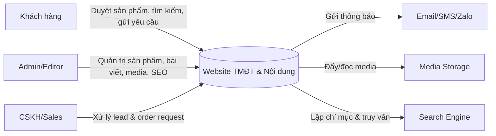
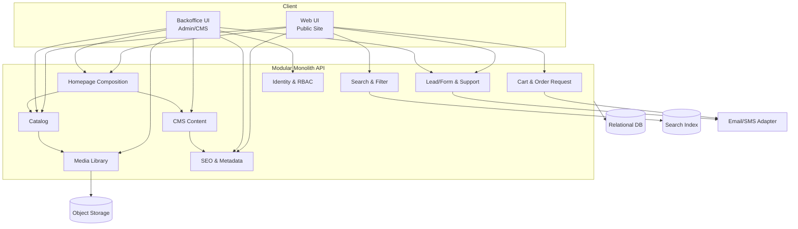

# TÀI LIỆU YÊU CẦU DỰ ÁN 

**Dự án:** Website Bán hàng / Thương mại điện tử & Tin tức
**Phiên bản:** 1.0
**Trạng thái:** Bản nháp (Draft)
**Ngày tạo:** [Ngày hiện tại]

---

## MỤC LỤC
1. [Yêu cầu Giao diện Người dùng (Front-end)](#1-yêu-cầu-giao-diện-người-dùng-front-end)
2. [Yêu cầu Tính năng Khách hàng](#2-yêu-cầu-tính-năng-khách-hàng)
3. [Yêu cầu Tính năng Quản trị (Back-end)](#3-yêu-cầu-tính-năng-quản-trị-back-end)
4. [Yêu cầu Phi chức năng & Kỹ thuật](#4-yêu-cầu-phi-chức-năng--kỹ-thuật)
5. [Đề xuất Thiết kế Hệ thống thích ứng Requirement (Quick Win)](#5-đề-xuất-thiết-kế-hệ-thống-thích-ứng-requirement-quick-win)

---

## 1. YÊU CẦU GIAO DIỆN NGƯỜI DÙNG (FRONT-END)

**ID:** REQ-001
**Title:** Header & Điều hướng (Trang chủ)
**Description:** Khu vực đầu trang hiển thị trên toàn bộ website giúp người dùng tìm kiếm và điều hướng.
**Priority:** Cao
**Status:** Draft
**Owner:** Product Owner
**Conditions of Satisfaction:**
- Tích hợp thanh tìm kiếm cho phép người dùng tìm sản phẩm bằng từ khóa.
- Hiển thị Module Menu (Topbar) dẫn đến các trang nội dung chính.
- Hiển thị Logo công ty (quản trị viên có thể thay đổi linh hoạt trong admin).

**ID:** REQ-002
**Title:** Banner & Danh mục nổi bật (Trang chủ)
**Description:** Khu vực quảng bá chiến dịch và lối tắt đến các ngành hàng.
**Priority:** Cao
**Status:** Draft
**Owner:** Product Owner
**Conditions of Satisfaction:**
- Hiển thị Banner chính (quản trị viên có thể thêm/sửa/xóa hoặc thay thế).
- Hiển thị nhóm sản phẩm chính dưới dạng Icon (vd: Điện thoại, Phụ kiện, Máy ảnh...).
- Click vào Icon sẽ dẫn đến trang danh sách sản phẩm của danh mục tương ứng.

**ID:** REQ-003
**Title:** Khối sản phẩm theo danh mục (Trang chủ)
**Description:** Hiển thị danh sách sản phẩm thuộc từng danh mục cụ thể ngay trên trang chủ.
**Priority:** Cao
**Status:** Draft
**Owner:** Product Owner
**Conditions of Satisfaction:**
- Mỗi danh mục (Điện thoại, Gia dụng...) là 1 block riêng biệt có tiêu đề và link "Xem tất cả".
- Hiển thị sản phẩm dạng lưới (Grid).
- Thẻ sản phẩm phải gồm: Ảnh, Tên, Giá bán (kèm giá gốc nếu có giảm giá), % Giảm giá, Nhãn (Mới, Bán chạy, Hot), Nút "Thêm vào giỏ hàng".
- (Tùy chọn) Có banner quảng cáo phụ hiển thị bên trái hoặc phía trên block.

**ID:** REQ-004
**Title:** Footer, Tin tức mới & Tiện ích (Trang chủ)
**Description:** Khu vực chân trang, bài viết mới và các nút hỗ trợ trôi nổi (Floating buttons).
**Priority:** Trung bình
**Status:** Draft
**Owner:** Product Owner
**Conditions of Satisfaction:**
- Khối tin tức hiển thị bài viết mới nhất (Ảnh, Tiêu đề, Mô tả ngắn, Ngày đăng). Số lượng do Admin cấu hình.
- Footer chia thành các cột: Thông tin công ty, Chính sách, Hướng dẫn mua hàng, Liên hệ, Mạng xã hội.
- Nút Floating góc màn hình bao gồm: Cuộn lên đầu trang, Zalo, Messenger, Hotline (Admin có thể bật/tắt và cài đặt link).

**ID:** REQ-005
**Title:** Trang Giới thiệu
**Description:** Trang thông tin tĩnh giới thiệu về doanh nghiệp.
**Priority:** Trung bình
**Status:** Draft
**Owner:** Product Owner
**Conditions of Satisfaction:**
- Hiển thị nội dung văn bản kết hợp hình ảnh.
- Tích hợp thư viện ảnh (Gallery) của công ty.
- Có khu vực hiển thị các tin bài liên quan.

**ID:** REQ-006
**Title:** Trang Danh sách Sản phẩm (Product Category)
**Description:** Nơi khách hàng duyệt sản phẩm theo bộ lọc và sắp xếp.
**Priority:** Cao
**Status:** Draft
**Owner:** Product Owner
**Conditions of Satisfaction:**
- Sidebar bên trái hiển thị cây danh mục để chuyển đổi nhanh.
- Tích hợp thanh kéo (slider) lọc theo khoảng giá (Min - Max) và nút "Lọc".
- Lọc theo thương hiệu kèm số lượng sản phẩm tương ứng.
- Tính năng Sắp xếp (Sorting): Tên A-Z / Z-A, Giá thấp-cao / cao-thấp, Mới nhất, Cũ nhất.
- Danh sách hiển thị dạng lưới (Grid) với đầy đủ thông tin: Ảnh, % giảm giá, Tên, Giá, Nút thêm giỏ hàng, Icon Xem nhanh (Quick view).

**ID:** REQ-007
**Title:** Trang Chi tiết Sản phẩm
**Description:** Trang hiển thị thông tin đầy đủ của một sản phẩm.
**Priority:** Cao
**Status:** Draft
**Owner:** Product Owner
**Conditions of Satisfaction:**
- Khu vực ảnh: Có ảnh chính lớn, ảnh thumbnail nhỏ bên dưới để chọn, có nhãn % giảm giá.
- Thông tin cơ bản: Tên, Thương hiệu, Mã SKU, Giá bán, Giá gốc, Số tiền tiết kiệm, Quà tặng kèm.
- Nút Call-to-action: "Thêm vào giỏ / Đặt mua" và "Yêu cầu tư vấn".
- Khu vực Tab thông tin: Tab Chi tiết sản phẩm, Tab Hướng dẫn, Tab Đánh giá (kèm số lượng đánh giá).

**ID:** REQ-008
**Title:** Trang Tin tức & Trang Liên hệ
**Description:** Giao diện đọc blog/tin tức và cổng thông tin liên hệ.
**Priority:** Trung bình
**Status:** Draft
**Owner:** Product Owner
**Conditions of Satisfaction:**
- Trang Bản tin hiển thị dạng lưới (Grid) gồm Ảnh đại diện, Tiêu đề, Giới thiệu ngắn.
- Trang Liên hệ hiển thị: Text thông tin công ty, Bản đồ (Google Maps), Form điền yêu cầu tư vấn.
- Trang Liên hệ có khu vực hiển thị danh sách Câu hỏi thường gặp (FAQ).

---

## 2. YÊU CẦU TÍNH NĂNG KHÁCH HÀNG

**ID:** REQ-009
**Title:** Tính năng Mua hàng & Giỏ hàng
**Description:** Luồng thao tác mua sản phẩm của khách hàng trên website.
**Priority:** Cao
**Status:** Draft
**Owner:** Product Owner
**Conditions of Satisfaction:**
- Khách hàng có thể click "Thêm vào giỏ hàng" từ trang chủ, trang danh sách hoặc trang chi tiết.
- Quản lý giỏ hàng: Xem danh sách sp đã chọn, thay đổi số lượng, xóa sản phẩm.
- Gửi yêu cầu đặt hàng thành công tới hệ thống (Không yêu cầu cổng thanh toán online phức tạp theo mô tả hiện tại).

**ID:** REQ-010
**Title:** Tương tác & Hỗ trợ trực tuyến
**Description:** Các phương thức khách hàng liên hệ với doanh nghiệp.
**Priority:** Cao
**Status:** Draft
**Owner:** Product Owner
**Conditions of Satisfaction:**
- Người dùng có thể điền Form yêu cầu tư vấn trên trang Chi tiết sản phẩm và trang Liên hệ.
- Khách hàng có thể click vào các nút Hỗ trợ trực tuyến (Live chat, Gọi điện, Zalo, Facebook) để kết nối ngay lập tức.

---

## 4. YÊU CẦU PHI CHỨC NĂNG & KỸ THUẬT

**ID:** REQ-015
**Title:** Thông số Kỹ thuật & Hạ tầng
**Description:** Cấu hình hosting và yêu cầu kỹ thuật nền tảng.
**Priority:** Cao
**Status:** Draft
**Owner:** DevOps / IT
**Conditions of Satisfaction:**
- Hệ thống chạy ổn định trên gói Hosting/Server dung lượng lưu trữ 4GB.
- Website được cài đặt Chứng chỉ bảo mật SSL miễn phí (Let's Encrypt hoặc tương đương), truy cập qua HTTPS.
- Website hỗ trợ tối ưu SEO Onpage (Thẻ Meta, URL thân thiện, Heading, Alt tag...).

**ID:** REQ-016
**Title:** Thích ứng Giao diện & Dịch vụ hỗ trợ
**Description:** Yêu cầu về độ tương thích và các dịch vụ bàn giao đi kèm.
**Priority:** Cao
**Status:** Draft
**Owner:** Development Team
**Conditions of Satisfaction:**
- Giao diện Responsive: Hiển thị và thao tác chuẩn xác trên đa thiết bị (Desktop, Tablet, Mobile).
- Hỗ trợ đổi màu chủ đề (Theme color) toàn website miễn phí 1 lần.
- Đội ngũ triển khai hỗ trợ nhập liệu ban đầu tối đa 25 bài viết hoặc sản phẩm.

---

## 5. ĐỀ XUẤT THIẾT KẾ HỆ THỐNG THÍCH ỨNG REQUIREMENT (QUICK WIN)

### 5.1. Nguyên tắc thiết kế
- Ưu tiên kiến trúc Modular Monolith (đơn khối phân mô-đun: 1 ứng dụng, tách domain rõ ràng) để triển khai nhanh, giảm rủi ro vận hành.
- Tách module theo domain, giao tiếp qua contract/interface ổn định để dễ thay đổi requirement.
- Áp dụng cấu hình động (config-driven) cho các phần hay thay đổi: homepage block, menu, banner, form, theme color.
- Chuẩn hóa database migration có rollback để thích ứng thay đổi schema an toàn.
- Tối ưu vận hành đơn giản theo hiện trạng hạ tầng: 1 ứng dụng + 1 database + lưu trữ media.

### 5.2. Đề xuất module cốt lõi
- Identity & RBAC (REQ-011)
- Catalog (REQ-013)
- Cart & Order Request (REQ-009)
- CMS Content (REQ-012)
- Media Library (REQ-014)
- Lead/Form & Support (REQ-010, REQ-014)
- Homepage Composition (REQ-001 đến REQ-004)
- Search & Filter (REQ-006)
- SEO & Metadata (REQ-015)

### 5.3. Lộ trình triển khai nhanh
**Giai đoạn 1 (Quick Win / MVP, 6-8 tuần):**
- Hoàn thành luồng bán hàng, quản trị nội dung cốt lõi, phân quyền admin.
- Scope ưu tiên: REQ-001, REQ-002, REQ-003, REQ-006, REQ-007, REQ-009, REQ-010, REQ-011, REQ-012, REQ-013, REQ-015 (cơ bản).

**Giai đoạn 2 (Tối ưu & mở rộng, 4-6 tuần):**
- Tăng khả năng thay đổi bằng cấu hình nâng cao và tác vụ nền (queue/job).
- Chuẩn bị tách module tải cao (Search/Media/Lead) khi cần scale.

### 5.4. KPI đo lường khả năng thích ứng
- Lead time cho thay đổi requirement nhỏ (không sửa schema DB, ảnh hưởng tối đa 1 module; ví dụ đổi rule validation, thêm block homepage dùng cấu hình): <= 3 ngày làm việc, tính từ lúc requirement được duyệt (có ticket, scope và tiêu chí nghiệm thu được Product Owner xác nhận) đến lúc deploy production.
- Tỷ lệ thay đổi không cần sửa code (chỉ qua cấu hình/CMS): >= 60% trên tổng số yêu cầu thay đổi đã triển khai trong mỗi quý (thiết lập baseline ở giai đoạn 1 bằng cách gắn nhãn ticket `config-only`/`code-change`, hiệu chỉnh mục tiêu sau quý đầu).
- Tỷ lệ lỗi nghiêm trọng sau release: < 3% trên tổng số hạng mục release trong kỳ (feature + bug fix); lỗi nghiêm trọng là lỗi ngăn mua hàng, đăng nhập admin hoặc mất dữ liệu.
- Uptime hệ thống theo tháng: >= 99.5% cho luồng người dùng công khai và admin, đo qua monitoring/health check; không tính thời gian bảo trì đã thông báo trước tối thiểu 24 giờ.

### 5.5. Rủi ro chính và giảm thiểu
- Requirement đổi liên tục: quản lý scope theo sprint, ưu tiên config-driven.
- Phụ thuộc chéo giữa module: áp dụng quy tắc dependency rõ ràng, review kiến trúc định kỳ.
- Rủi ro thay đổi schema DB: dùng mô hình migration mở rộng-thu gọn (expand/contract) và có kế hoạch rollback.
- Media tăng nhanh gây áp lực lưu trữ: nén ảnh, policy dọn dẹp và tách lưu trữ media khi cần.

### 5.6. Bổ sung kiến trúc (Diagram)

#### A) System Context (mức hệ thống)

#### B) Container/Module Diagram (mức triển khai nhanh)

#### C) Nguyên tắc mapping Diagram -> Quick Win triển khai

- Một ứng dụng nhiều module domain: triển khai MVP nhanh, vẫn giữ ranh giới để tách dần khi cần.
- Identity & RBAC là cổng vào backoffice để khóa quyền truy cập ngay từ giai đoạn đầu.
- Catalog + Media + Search & Filter được ưu tiên cùng nhau để bảo đảm luồng duyệt/tìm sản phẩm.
- CMS Content + Homepage Composition + SEO giúp phần lớn thay đổi nội dung/giao diện thực hiện qua cấu hình.
- Cart & Order Request + Lead/Form tái sử dụng adapter thông báo để giảm effort tích hợp.
- DB tập trung cho dữ liệu nghiệp vụ, Object Storage tách riêng cho media để tăng khả năng mở rộng.
- Search Index đi theo lộ trình: MVP có thể chạy DB filter, giai đoạn sau nâng cấp indexing.
