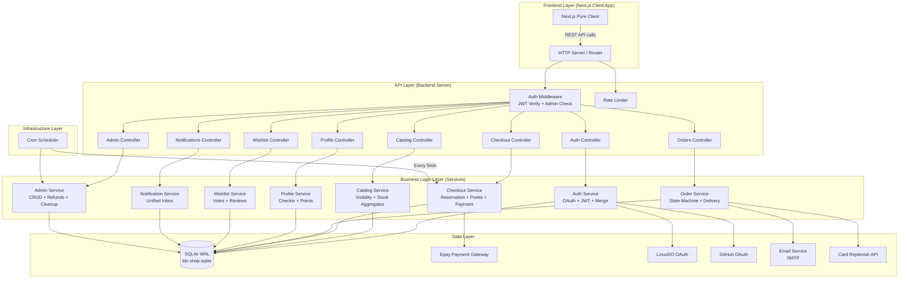
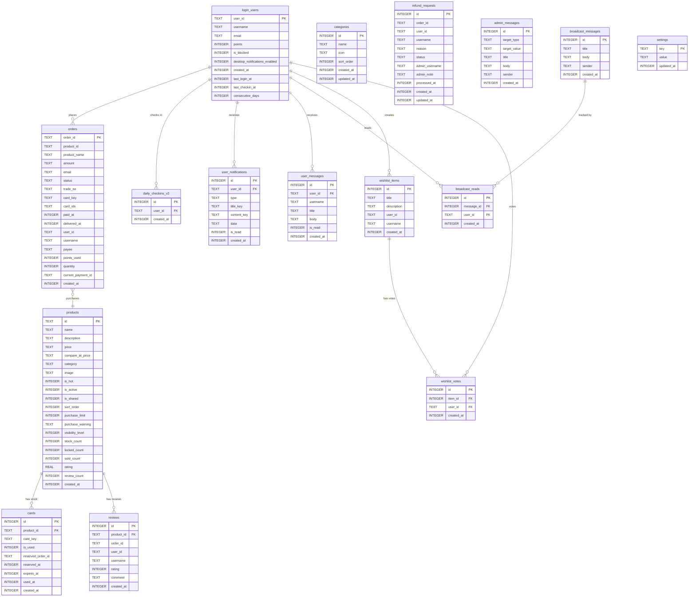

# Backend Server Implementation Plan

## Goal

Xây dựng REST API backend server tách biệt hoàn toàn khỏi Next.js frontend, chịu trách nhiệm **100% logic nghiệp vụ** (tính toán giá, quản lý kho, xử lý thanh toán, xác thực, phân quyền). Frontend chỉ nhận dữ liệu đã được xử lý sẵn (statusText, statusColor, maxPurchaseableQuantity, finalPrice...) và render UI thuần túy theo nguyên tắc **Dumb Frontend**.

Backend sử dụng SQLite (tương thích schema hiện tại), expose 39+ REST endpoints chia theo 8 modules nghiệp vụ, hỗ trợ JWT Bearer authentication, payment gateway integration (Epay MD5 sign), background cron jobs, và webhook processing.

---

## Requirements

### Functional Requirements
- Cung cấp đầy đủ 39 REST API endpoints theo spec tại `/docs/migration/legacy_logic/api-spec.md`
- Triển khai toàn bộ business rules từ `/docs/migration/legacy_logic/domain-rules.md`
- Hỗ trợ OAuth callback (LinuxDO + GitHub) và issue JWT access/refresh tokens
- Stock reservation atomic lock (5 phút TTL) với fallback expired grab
- Shared product infinite stock logic
- Points discount calculation server-side (ceil rounding, zero-price flow)
- Order status state machine với status/color mapping cho Dumb Frontend
- Cron cleanup: expired cards, expired reservations, cancelled pending orders
- Payment webhook (Epay) với MD5 signature verification + idempotent processing
- Admin authorization via `ADMIN_USERS` env var
- Unified notification inbox (personal + broadcast)
- Account merge logic (LinuxDO ↔ GitHub)

### Non-Functional Requirements
- SQLite single-file database (production-ready, WAL mode)
- Atomic operations để tránh race conditions (UPDATE...RETURNING, conditional WHERE)
- Response time < 100ms cho read operations
- Horizontal scaling qua read replicas (SQLite WAL mode)
- Docker containerization
- Health check endpoint
- Structured logging (JSON)
- Rate limiting on checkout/auth endpoints

---

## Technical Considerations

### System Architecture Overview



### Technology Stack Selection

| Layer | Technology | Rationale |
|-------|-----------|-----------|
| **Runtime** | Node.js 20+ (LTS) | Tương thích ecosystem hiện tại, async I/O tốt cho SQLite |
| **Framework** | Hono / Fastify | Lightweight, TypeScript-first, middleware chain, tốc độ cao |
| **Database** | better-sqlite3 (SQLite WAL) | Giữ nguyên schema, zero-config, atomic transactions nhanh |
| **ORM/Query** | Drizzle ORM | Type-safe queries, migration support, đã có schema sẵn |
| **Auth** | jose (JWT) | Lightweight JWT sign/verify, no heavy dependencies |
| **Validation** | Zod | Runtime type validation cho request bodies |
| **Cron** | node-cron | Background jobs (cleanup expired cards/orders) |
| **HTTP Client** | undici / native fetch | Gọi Epay API, OAuth providers, Card replenish API |
| **Logging** | pino | Structured JSON logging, fast |
| **Testing** | Vitest | Fast unit/integration tests |
| **Containerization** | Docker + docker-compose | Production deployment |

### Integration Points

| Integration | Protocol | Authentication |
|-------------|----------|---------------|
| Frontend ↔ Backend | REST/JSON over HTTPS | JWT Bearer token |
| Backend → Epay Gateway | HTTPS POST (form-encoded) | MD5 signature |
| Epay → Backend (webhook) | HTTPS POST | MD5 signature verification |
| Backend → LinuxDO OAuth | HTTPS (OAuth 2.0) | Client ID/Secret |
| Backend → GitHub OAuth | HTTPS (OAuth 2.0) | Client ID/Secret |
| Backend → Email SMTP | SMTP/TLS | Username/Password |
| Backend → Card Replenish API | HTTPS | API Key |

### Deployment Architecture

```
docker-compose.yml
├── backend (Node.js app)
│   ├── Port 4000
│   ├── Volume: ./data/ldc-shop.sqlite
│   └── ENV: JWT_SECRET, ADMIN_USERS, EPAY_*, OAUTH_*, SMTP_*
└── frontend (Next.js static/client)
    ├── Port 3000
    └── ENV: NEXT_PUBLIC_API_URL=http://backend:4000
```

---

### Database Schema Design



#### Indexing Strategy

```sql
-- Performance-critical indexes
CREATE INDEX idx_cards_available ON cards(product_id, is_used, reserved_at, expires_at);
CREATE INDEX idx_orders_user ON orders(user_id, status);
CREATE INDEX idx_orders_email ON orders(email, product_id, status);
CREATE INDEX idx_orders_pending_created ON orders(status, created_at) WHERE status = 'pending';
CREATE INDEX idx_products_active ON products(is_active, visibility_level, sort_order);
CREATE INDEX idx_reviews_product ON reviews(product_id);
CREATE INDEX idx_notifications_user_unread ON user_notifications(user_id, is_read);
CREATE INDEX idx_broadcast_reads_user ON broadcast_reads(user_id, message_id);
CREATE INDEX idx_wishlist_votes_item ON wishlist_votes(item_id, user_id);
CREATE INDEX idx_cards_reserved_expired ON cards(reserved_at, reserved_order_id) WHERE reserved_order_id IS NOT NULL;
```

#### Database Migration Strategy

- Drizzle Kit migrations stored in `lib/db/migrations/`
- Versioned `0001_initial.sql`, `0002_add_indexes.sql`, etc.
- Migration runs at app startup before accepting requests
- Rollback scripts for each migration

---

### API Design

#### Module 1: Auth

| Method | Path | Auth | Description |
|--------|------|------|-------------|
| GET | `/api/auth/oauth/linuxdo` | Public | Redirect → LinuxDO OAuth |
| GET | `/api/auth/oauth/github` | Public | Redirect → GitHub OAuth |
| GET | `/api/auth/callback/linuxdo` | Public | OAuth callback, issue tokens |
| GET | `/api/auth/callback/github` | Public | OAuth callback, merge accounts |
| POST | `/api/auth/refresh` | RefreshToken | Rotate access + refresh tokens |
| POST | `/api/auth/logout` | Bearer | Invalidate token pair |
| GET | `/api/auth/me` | Bearer | Current user profile |

**Token Structure:**
```typescript
interface AccessTokenPayload {
  sub: string          // userId
  username: string
  email: string | null
  trustLevel: number
  isAdmin: boolean
  iat: number
  exp: number          // 15 min
}

interface RefreshTokenPayload {
  sub: string
  jti: string          // unique token ID for revocation
  iat: number
  exp: number          // 7 days
}
```

**Account Merge Algorithm (GitHub login):**
```
1. OAuth callback → get GitHub profile (id, username, email)
2. Normalize userId = `github:${id}`, username = `gh_${username.toLowerCase()}`
3. Check existing user by email OR username in login_users
4. If match found (sourceUser):
   a. Merge points, blocked status, notification prefs
   b. Deduplicate broadcast_reads + wishlist_votes
   c. UPDATE user_id in all relation tables (orders, reviews, refunds, checkins, notifications, messages, wishlist)
   d. UPDATE username in display tables
   e. DELETE source user record
5. Upsert target user, issue JWT pair
6. Redirect to frontend `/callback?token=...`
```

#### Module 2: Catalog

| Method | Path | Auth | Description |
|--------|------|------|-------------|
| GET | `/api/catalog/products` | Optional | Product list (visibility filtered) |
| GET | `/api/catalog/products/:id` | Optional | Product detail + maxPurchaseableQuantity |
| GET | `/api/catalog/products/:id/buy-meta` | Optional | Reviews, canReview flag |
| GET | `/api/catalog/search` | Optional | Full-text search + sort + paginate |
| GET | `/api/catalog/categories` | Public | Category list |
| GET | `/api/catalog/settings` | Public | Shop config (theme, name, features) |
| GET | `/api/catalog/announcement` | Public | Current announcement |

**Key Business Logic - Visibility Filter:**
```typescript
function resolveVisibilityThreshold(user: AuthUser | null): number {
  if (!user) return -1
  return Math.max(0, user.trustLevel ?? 0)
}

// SQL condition applied to ALL catalog queries
// WHERE is_active = 1 AND COALESCE(visibility_level, -1) <= :threshold
```

**Key Business Logic - Stock Display:**
```typescript
function computeDisplayStock(product: Product): number {
  if (product.isShared) {
    // Shared product: infinite if any card exists
    const hasAvailableCard = existsAvailableSharedCard(product.id)
    return hasAvailableCard ? 999999 : 0
  }
  return product.stockCount - product.lockedCount
}
```

**Key Business Logic - maxPurchaseableQuantity:**
```typescript
function computeMaxPurchaseable(product: Product, userId: string, email: string): number {
  const maxStock = product.isShared 
    ? 999999 
    : (product.stockCount - product.lockedCount)
  
  if (!product.purchaseLimit) return maxStock
  
  const totalBought = db.query(`
    SELECT COALESCE(SUM(quantity), COUNT(*)) AS total
    FROM orders
    WHERE product_id = ? 
      AND (user_id = ? OR email = ?)
      AND status IN ('paid', 'delivered')
  `, [product.id, userId, email])
  
  return Math.min(maxStock, product.purchaseLimit - totalBought)
}
```

#### Module 3: Checkout & Payment

| Method | Path | Auth | Description |
|--------|------|------|-------------|
| GET | `/api/checkout/preview` | Bearer | Calculate price with points |
| POST | `/api/checkout/orders` | Optional | Create order + reserve stock |
| POST | `/api/checkout/payment-orders` | Optional | Direct payment order |
| GET | `/api/checkout/orders/:id/payment-params` | Bearer | Retry payment params |
| GET | `/api/checkout/orders/:id/status` | Optional | Poll order status |
| POST | `/api/checkout/orders/:id/cancel` | Bearer | Cancel pending order |
| POST | `/api/checkout/notify` | Gateway Sig | Epay webhook |
| GET | `/api/checkout/callback/:id` | Public | Post-payment redirect |

**Key Business Logic - Checkout Preview:**
```typescript
function calculatePreview(product: Product, quantity: number, usePoints: boolean, user: User) {
  const numericalPrice = quantity * parseFloat(product.price)
  let pointsToUse = 0
  
  if (usePoints && user.points > 0) {
    pointsToUse = Math.min(user.points, Math.ceil(numericalPrice))
  }
  
  const finalPrice = Math.max(0, numericalPrice - pointsToUse)
  
  return { numericalPrice, pointsToUse, finalPrice }
}
```

**Key Business Logic - Atomic Stock Reservation:**
```typescript
async function reserveCards(productId: string, orderId: string, quantity: number): Promise<Card[]> {
  const now = Date.now()
  const reserved: Card[] = []
  
  for (let i = 0; i < quantity; i++) {
    // Method A: Grab free card atomically
    let card = db.exec(`
      UPDATE cards
      SET reserved_order_id = ?, reserved_at = ?
      WHERE id = (
        SELECT id FROM cards
        WHERE product_id = ?
          AND (is_used = 0 OR is_used IS NULL)
          AND reserved_at IS NULL
          AND (expires_at IS NULL OR expires_at > ?)
        LIMIT 1
      )
      RETURNING id, card_key
    `, [orderId, now, productId, now])
    
    if (!card) {
      // Method B: Steal expired reservation
      const expired = db.query(`
        SELECT id, card_key, reserved_order_id FROM cards
        WHERE product_id = ? 
          AND (is_used = 0 OR is_used IS NULL)
          AND reserved_at < ?
          AND reserved_order_id IS NOT NULL
        LIMIT 1
      `, [productId, now - RESERVATION_TTL_MS])
      
      if (expired) {
        // Check if candidate order was actually paid
        const candidateStatus = await epayQueryStatus(expired.reserved_order_id)
        if (candidateStatus === 'paid') {
          // Fulfill the old order instead, continue searching
          await fulfillOrder(expired.reserved_order_id, expired)
          i-- // retry this slot
          continue
        }
        // Steal the card
        card = db.exec(`
          UPDATE cards
          SET reserved_order_id = ?, reserved_at = ?
          WHERE id = ? AND reserved_order_id = ?
          RETURNING id, card_key
        `, [orderId, now, expired.id, expired.reserved_order_id])
      }
    }
    
    if (!card) throw new AppError('buy.outOfStock')
    reserved.push(card)
  }
  
  return reserved
}
```

**Key Business Logic - Zero-Price Flow:**
```typescript
async function handleZeroPriceOrder(order: Order, cards: Card[], pointsToUse: number) {
  // Atomic points deduction with guard
  const result = db.exec(`
    UPDATE login_users
    SET points = points - ?
    WHERE user_id = ? AND points >= ?
  `, [pointsToUse, order.userId, pointsToUse])
  
  if (result.changes === 0) throw new AppError('insufficient_points')
  
  try {
    // Mark cards as sold
    for (const card of cards) {
      db.exec(`
        UPDATE cards SET is_used = 1, used_at = ?, reserved_order_id = NULL, reserved_at = NULL
        WHERE id = ?
      `, [Date.now(), card.id])
    }
    
    // Deliver order immediately
    db.exec(`
      UPDATE orders 
      SET status = 'delivered', trade_no = 'POINTS_REDEMPTION',
          card_key = ?, card_ids = ?, delivered_at = ?, paid_at = ?
      WHERE order_id = ?
    `, [cards.map(c => c.cardKey).join('\n'), cards.map(c => c.id).join(','), Date.now(), Date.now(), order.orderId])
    
  } catch (err) {
    // Rollback points on failure
    db.exec(`UPDATE login_users SET points = points + ? WHERE user_id = ?`, [pointsToUse, order.userId])
    throw err
  }
}
```

**Key Business Logic - Epay Webhook (Idempotent):**
```typescript
async function handlePaymentNotify(params: EpayNotifyParams) {
  // 1. Verify MD5 signature
  const expectedSign = generateEpaySign(params, EPAY_MERCHANT_KEY)
  if (params.sign !== expectedSign) throw new AppError('invalid_signature')
  
  // 2. Idempotent check
  const order = db.queryOne(`SELECT * FROM orders WHERE order_id = ?`, [params.out_trade_no])
  if (!order || order.status !== 'pending') return 'success' // already processed
  
  // 3. Process payment
  if (params.trade_status === 'TRADE_SUCCESS') {
    db.exec(`UPDATE orders SET status = 'paid', trade_no = ?, paid_at = ? WHERE order_id = ?`,
      [params.trade_no, Date.now(), order.orderId])
    
    // Deliver cards
    await deliverOrderCards(order)
    
    // Send notifications
    await sendDeliveryEmail(order)
    await createUserNotification(order.userId, 'order_delivered', order.orderId)
  }
  
  return 'success'
}
```

**Epay MD5 Signature Generation:**
```typescript
function generateEpaySign(params: Record<string, string>, merchantKey: string): string {
  // Sort params alphabetically, exclude empty values and 'sign'/'sign_type'
  const sorted = Object.keys(params)
    .filter(k => k !== 'sign' && k !== 'sign_type' && params[k] !== '')
    .sort()
    .map(k => `${k}=${params[k]}`)
    .join('&')
  
  return md5(sorted + merchantKey)
}
```

#### Module 4: Orders

| Method | Path | Auth | Description |
|--------|------|------|-------------|
| GET | `/api/orders` | Bearer | My orders list (paginated) |
| GET | `/api/orders/:id` | Bearer | Order detail + card keys |
| GET | `/api/orders/:id/status` | Bearer | Poll status |
| POST | `/api/orders/:id/cancel` | Bearer | Cancel pending order |
| POST | `/api/orders/:id/refund-request` | Bearer | Submit refund request |

**Key Business Logic - Status Mapping (Dumb Frontend):**
```typescript
const STATUS_MAP: Record<string, { statusText: string; statusColor: string }> = {
  pending:   { statusText: 'Chờ thanh toán',           statusColor: 'orange' },
  paid:      { statusText: 'Đang xử lý (Đã thanh toán)', statusColor: 'blue' },
  delivered: { statusText: 'Đã giao hàng',            statusColor: 'green' },
  cancelled: { statusText: 'Đã hủy',                  statusColor: 'red' },
  refunded:  { statusText: 'Đã hoàn tiền',            statusColor: 'purple' },
  failed:    { statusText: 'Thất bại',                 statusColor: 'red' },
}

function mapOrderForFrontend(order: DbOrder): OrderDTO {
  const { statusText, statusColor } = STATUS_MAP[order.status]
  return {
    ...order,
    statusText,
    statusColor,
    // Security: hide card key unless delivered
    cardKey: order.status === 'delivered' ? order.cardKey : null,
  }
}
```

**Key Business Logic - Cancel Order:**
```typescript
async function cancelOrder(orderId: string, userId: string) {
  const order = db.queryOne(`SELECT * FROM orders WHERE order_id = ? AND user_id = ?`, [orderId, userId])
  if (!order || order.status !== 'pending') throw new AppError('order.cannotCancel')
  
  db.transaction(() => {
    // 1. Update order status
    db.exec(`UPDATE orders SET status = 'cancelled' WHERE order_id = ?`, [orderId])
    
    // 2. Release reserved cards
    db.exec(`
      UPDATE cards SET reserved_order_id = NULL, reserved_at = NULL
      WHERE reserved_order_id = ?
    `, [orderId])
    
    // 3. Refund points if used
    if (order.pointsUsed > 0) {
      db.exec(`UPDATE login_users SET points = points + ? WHERE user_id = ?`, 
        [order.pointsUsed, order.userId])
    }
    
    // 4. Recalculate product stock aggregates
    recalcProductAggregates(order.productId)
  })
}
```

#### Module 5: Profile & Check-in

| Method | Path | Auth | Description |
|--------|------|------|-------------|
| GET | `/api/profile` | Bearer | Full profile dashboard |
| PATCH | `/api/profile/email` | Bearer | Update email |
| PATCH | `/api/profile/notifications` | Bearer | Toggle desktop notifications |
| GET | `/api/profile/points` | Bearer | Points balance |
| POST | `/api/profile/checkin` | Bearer | Daily check-in |
| GET | `/api/profile/checkin/status` | Bearer | Check-in status |

**Key Business Logic - Atomic Check-in Streak:**
```typescript
async function performCheckin(userId: string) {
  // Check system setting
  const checkinEnabled = db.getSetting('checkin_enabled')
  if (checkinEnabled === 'false') throw new AppError('checkin.disabled')
  
  const reward = parseInt(db.getSetting('checkin_reward') || '10')
  const now = Date.now()
  const todayStartUtcMs = Date.UTC(
    new Date().getUTCFullYear(), 
    new Date().getUTCMonth(), 
    new Date().getUTCDate()
  )
  const yesterdayStartUtcMs = todayStartUtcMs - 86_400_000
  
  const result = db.exec(`
    UPDATE login_users
    SET points = points + ?,
        last_checkin_at = ?,
        consecutive_days = CASE
          WHEN last_checkin_at IS NOT NULL
            AND last_checkin_at >= ?
            AND last_checkin_at < ?
          THEN COALESCE(consecutive_days, 0) + 1
          ELSE 1
        END
    WHERE user_id = ?
      AND (last_checkin_at IS NULL OR last_checkin_at < ?)
  `, [reward, now, yesterdayStartUtcMs, todayStartUtcMs, userId, todayStartUtcMs])
  
  if (result.changes === 0) throw new AppError('checkin.alreadyCheckedIn')
  
  // Record history
  db.exec(`INSERT INTO daily_checkins_v2 (user_id, created_at) VALUES (?, ?)`, [userId, now])
  
  const user = db.queryOne(`SELECT consecutive_days FROM login_users WHERE user_id = ?`, [userId])
  return { pointsEarned: reward, consecutiveDays: user.consecutive_days }
}
```

#### Module 6: Wishlist & Reviews

| Method | Path | Auth | Description |
|--------|------|------|-------------|
| GET | `/api/wishlist` | Optional | List wishlist items + votes |
| POST | `/api/wishlist` | Bearer | Create wishlist item |
| POST | `/api/wishlist/:id/vote` | Bearer | Toggle vote |
| DELETE | `/api/wishlist/:id` | Bearer | Delete item (owner/admin) |
| GET | `/api/products/:id/reviews` | Public | Product reviews |
| POST | `/api/products/:id/reviews` | Bearer | Submit review |

**Key Business Logic - Review Constraints:**
```typescript
async function submitReview(userId: string, productId: string, orderId: string, rating: number, comment: string) {
  // Validate rating range
  if (rating < 1 || rating > 5) throw new AppError('review.invalidRating')
  
  // Verify order ownership + delivered status
  const order = db.queryOne(`
    SELECT * FROM orders 
    WHERE order_id = ? AND product_id = ? AND user_id = ? AND status = 'delivered'
  `, [orderId, productId, userId])
  if (!order) throw new AppError('review.orderNotEligible')
  
  // Check not already reviewed
  const existing = db.queryOne(`SELECT id FROM reviews WHERE order_id = ?`, [orderId])
  if (existing) throw new AppError('review.alreadyReviewed')
  
  // Insert review
  db.exec(`INSERT INTO reviews (product_id, order_id, user_id, username, rating, comment, created_at)
    VALUES (?, ?, ?, ?, ?, ?, ?)`, 
    [productId, orderId, userId, order.username, rating, comment, Date.now()])
  
  // Recalculate product rating aggregates
  const stats = db.queryOne(`
    SELECT AVG(rating) as avg_rating, COUNT(*) as count FROM reviews WHERE product_id = ?
  `, [productId])
  db.exec(`UPDATE products SET rating = ?, review_count = ? WHERE id = ?`,
    [stats.avg_rating, stats.count, productId])
}
```

#### Module 7: Notifications

| Method | Path | Auth | Description |
|--------|------|------|-------------|
| GET | `/api/notifications` | Bearer | Unified inbox |
| GET | `/api/notifications/unread-count` | Bearer | Badge count |
| POST | `/api/notifications/:id/read` | Bearer | Mark one read |
| POST | `/api/notifications/read-all` | Bearer | Mark all read |
| POST | `/api/notifications/clear` | Bearer | Clear all |

**Key Business Logic - Unified Unread Count:**
```typescript
function getUnreadCount(userId: string): number {
  const BROADCAST_LIMIT = 10
  
  // Personal unread
  const personalUnread = db.queryOne(`
    SELECT COUNT(*) as count FROM user_notifications 
    WHERE user_id = ? AND is_read = 0
  `, [userId]).count
  
  // Broadcast unread (max 10 latest, after user's clear timestamp)
  const clearedAt = db.getSetting(`broadcast_cleared_at:${userId}`) || '0'
  
  const broadcastTotal = db.queryOne(`
    SELECT COUNT(*) as count FROM broadcast_messages 
    WHERE created_at > ? ORDER BY created_at DESC LIMIT ?
  `, [parseInt(clearedAt), BROADCAST_LIMIT]).count
  
  const broadcastRead = db.queryOne(`
    SELECT COUNT(*) as count FROM broadcast_reads 
    WHERE user_id = ? AND message_id IN (
      SELECT id FROM broadcast_messages WHERE created_at > ? 
      ORDER BY created_at DESC LIMIT ?
    )
  `, [userId, parseInt(clearedAt), BROADCAST_LIMIT]).count
  
  return personalUnread + Math.max(0, broadcastTotal - broadcastRead)
}
```

#### Module 8: Admin

| Method | Path | Auth | Description |
|--------|------|------|-------------|
| GET | `/api/admin/products` | Admin | List all products |
| POST | `/api/admin/products` | Admin | Create product |
| PATCH | `/api/admin/products/:id` | Admin | Update product |
| DELETE | `/api/admin/products/:id` | Admin | Delete product |
| POST | `/api/admin/products/:id/toggle` | Admin | Toggle active |
| POST | `/api/admin/products/reorder` | Admin | Reorder products |
| GET | `/api/admin/cards` | Admin | List cards |
| POST | `/api/admin/cards/import` | Admin | Bulk import cards |
| DELETE | `/api/admin/cards/:id` | Admin | Delete card |
| POST | `/api/admin/cards/pull` | Admin | Pull from API |
| GET | `/api/admin/orders` | Admin | All orders |
| PATCH | `/api/admin/orders/:id` | Admin | Update order |
| DELETE | `/api/admin/orders/:id` | Admin | Delete order |
| GET | `/api/admin/refund-requests` | Admin | Refund requests list |
| POST | `/api/admin/refund-requests/:id/approve` | Admin | Approve refund |
| POST | `/api/admin/refund-requests/:id/reject` | Admin | Reject refund |
| GET | `/api/admin/users` | Admin | Users list |
| PATCH | `/api/admin/users/:id` | Admin | Update user |
| GET | `/api/admin/settings` | Admin | All settings |
| PATCH | `/api/admin/settings` | Admin | Update settings |
| GET | `/api/admin/categories` | Admin | Categories |
| POST | `/api/admin/categories` | Admin | Create category |
| DELETE | `/api/admin/categories/:id` | Admin | Delete category |
| POST | `/api/admin/notifications/broadcast` | Admin | Send broadcast |
| POST | `/api/admin/data/import` | Admin | Import data |
| POST | `/api/admin/data/repair` | Admin | Repair aggregates |

**Key Business Logic - Approve Refund:**
```typescript
async function approveRefund(requestId: number, adminUsername: string) {
  const request = db.queryOne(`SELECT * FROM refund_requests WHERE id = ?`, [requestId])
  if (!request || request.status !== 'pending') throw new AppError('refund.notFound')
  
  const order = db.queryOne(`SELECT * FROM orders WHERE order_id = ?`, [request.orderId])
  
  db.transaction(() => {
    // 1. Update refund request
    db.exec(`
      UPDATE refund_requests SET status = 'approved', admin_username = ?, processed_at = ?
      WHERE id = ?
    `, [adminUsername, Date.now(), requestId])
    
    // 2. Update order status
    db.exec(`UPDATE orders SET status = 'refunded' WHERE order_id = ?`, [request.orderId])
    
    // 3. Refund points
    if (order.pointsUsed > 0) {
      db.exec(`UPDATE login_users SET points = points + ? WHERE user_id = ?`,
        [order.pointsUsed, order.userId])
    }
    
    // 4. Reclaim cards (if enabled and not shared product)
    const reclaimEnabled = db.getSetting('refund_reclaim_cards') !== 'false'
    const product = db.queryOne(`SELECT is_shared FROM products WHERE id = ?`, [order.productId])
    
    if (reclaimEnabled && !product.isShared && order.cardIds) {
      const cardIds = order.cardIds.split(',').map(Number)
      for (const cardId of cardIds) {
        db.exec(`
          UPDATE cards SET is_used = 0, used_at = NULL, reserved_order_id = NULL, reserved_at = NULL
          WHERE id = ?
        `, [cardId])
      }
    }
    
    // 5. Recalculate stock
    recalcProductAggregates(order.productId)
    
    // 6. Notify user
    createUserNotification(order.userId, 'refund_approved', { orderId: order.orderId })
  })
}
```

---

### Cron Jobs (Background Tasks)

| Job | Interval | Logic |
|-----|----------|-------|
| Cancel Expired Orders | Every 1 min | Find `pending` orders where `created_at < now - 300000`, cancel + release cards + refund points |
| Cleanup Expired Cards | Every 10 min | Delete cards where `expires_at < now`, recalc product aggregates |
| Stock Aggregate Sync | Every 5 min | Recalculate `stock_count`, `locked_count`, `sold_count` for all products |

**Recalculate Product Aggregates:**
```typescript
function recalcProductAggregates(productId: string) {
  const now = Date.now()
  const fiveMinAgo = now - RESERVATION_TTL_MS
  
  const stats = db.queryOne(`
    SELECT
      COUNT(*) FILTER (WHERE (is_used = 0 OR is_used IS NULL) 
        AND (reserved_order_id IS NULL OR reserved_at < ?)
        AND (expires_at IS NULL OR expires_at > ?)) as stock_count,
      COUNT(*) FILTER (WHERE (is_used = 0 OR is_used IS NULL)
        AND reserved_order_id IS NOT NULL AND reserved_at >= ?) as locked_count,
      COUNT(*) FILTER (WHERE is_used = 1) as sold_count
    FROM cards WHERE product_id = ?
  `, [fiveMinAgo, now, fiveMinAgo, productId])
  
  db.exec(`
    UPDATE products SET stock_count = ?, locked_count = ?, sold_count = ?
    WHERE id = ?
  `, [stats.stock_count, stats.locked_count, stats.sold_count, productId])
}
```

---

### Frontend Architecture (Dumb Frontend Contract)

Frontend **không chứa bất kỳ logic nào** ngoài:
- Gọi API và render response trực tiếp
- Form validation cơ bản (email format, required fields)
- Navigation/routing
- Token management (store/attach/refresh)

**Component nhận dữ liệu đã xử lý sẵn từ backend:**

```
Page/Component Tree
├── Layout
│   ├── SiteHeader (từ GET /api/auth/me → user avatar, isAdmin flag)
│   └── Footer (từ GET /api/catalog/settings → shopFooter)
├── Home Page
│   ├── CategoryFilter (từ GET /api/catalog/categories)
│   ├── ProductGrid (từ GET /api/catalog/products → items với stock đã tính)
│   └── Announcement (từ GET /api/catalog/announcement)
├── Product Detail (/buy/:id)
│   ├── ProductInfo (từ GET /api/catalog/products/:id)
│   ├── QuantitySelector (max = response.maxPurchaseableQuantity)
│   ├── PriceDisplay (từ GET /api/checkout/preview → finalPrice)
│   └── ReviewList (từ GET /api/catalog/products/:id/buy-meta)
├── Orders (/orders)
│   └── OrderCard (statusText + statusColor từ backend, cardKey null nếu chưa delivered)
├── Profile (/profile)
│   ├── PointsDisplay (từ GET /api/profile → pointsBalance)
│   ├── CheckinButton (từ GET /api/profile/checkin/status → hasCheckedInToday)
│   └── OrderStats (từ GET /api/profile → orderStats)
└── Admin (/admin/*)
    └── Full CRUD forms calling admin API endpoints
```

---

### Security & Performance

#### Authentication / Authorization
- JWT access token (15 min TTL) in memory, refresh token (7 days) in httpOnly cookie
- Admin check: `ADMIN_USERS` env → split by comma → case-insensitive match
- Blocked user check on every mutating operation
- Visibility level enforcement at DB query level (không leak data qua API)

#### Data Validation & Sanitization
- Zod schemas for all request bodies
- SQL parameterized queries (no string interpolation)
- Rate limiting: 5 req/s on checkout, 10 req/s on auth, 100 req/s default
- Input length limits: comment max 500 chars, title max 100 chars

#### Performance Optimization
- SQLite WAL mode for concurrent reads
- Aggregate cache fields (`stock_count`, `locked_count`, `sold_count`, `rating`, `review_count`) avoid expensive JOINs/COUNTs
- Connection pooling via better-sqlite3 (synchronous, no pool needed)
- Response caching: categories + settings + announcement (60s TTL)
- Pagination: default 20 items, max 100

#### Error Response Format
```typescript
// Success
{ "success": true, ...data }

// Error
{ "success": false, "error": "buy.outOfStock", "message": "Sản phẩm đã hết hàng" }
```

Error codes preserve i18n keys:
- `buy.outOfStock`, `buy.invalidQuantity`, `buy.limitExceeded`
- `auth.unauthorized`, `auth.forbidden`, `auth.blocked`
- `order.cannotCancel`, `order.notFound`
- `checkin.alreadyCheckedIn`, `checkin.disabled`
- `review.alreadyReviewed`, `review.orderNotEligible`
- `insufficient_points`

---

## Folder Structure (Backend Server)

```
backend/
├── package.json
├── tsconfig.json
├── Dockerfile
├── drizzle.config.ts
├── src/
│   ├── index.ts                    # Entry point: create app + start server
│   ├── app.ts                      # Hono/Fastify app setup + global middleware
│   ├── config/
│   │   ├── env.ts                  # Environment variable validation (Zod)
│   │   └── constants.ts            # RESERVATION_TTL_MS, INFINITE_STOCK, etc.
│   ├── middleware/
│   │   ├── auth.middleware.ts      # JWT verify, attach user to context
│   │   ├── admin.middleware.ts     # Admin check (ADMIN_USERS env)
│   │   ├── rate-limit.middleware.ts
│   │   └── error-handler.ts       # Global error → JSON response
│   ├── modules/
│   │   ├── auth/
│   │   │   ├── auth.controller.ts
│   │   │   ├── auth.service.ts     # OAuth, JWT, merge logic
│   │   │   ├── auth.schema.ts      # Zod request schemas
│   │   │   └── auth.types.ts
│   │   ├── catalog/
│   │   │   ├── catalog.controller.ts
│   │   │   ├── catalog.service.ts  # Visibility, stock computation
│   │   │   └── catalog.schema.ts
│   │   ├── checkout/
│   │   │   ├── checkout.controller.ts
│   │   │   ├── checkout.service.ts # Reservation, points, payment
│   │   │   ├── checkout.schema.ts
│   │   │   └── epay.util.ts       # MD5 sign, verify
│   │   ├── orders/
│   │   │   ├── orders.controller.ts
│   │   │   ├── orders.service.ts   # State machine, delivery
│   │   │   └── orders.schema.ts
│   │   ├── profile/
│   │   │   ├── profile.controller.ts
│   │   │   ├── profile.service.ts  # Checkin, points
│   │   │   └── profile.schema.ts
│   │   ├── wishlist/
│   │   │   ├── wishlist.controller.ts
│   │   │   ├── wishlist.service.ts
│   │   │   └── wishlist.schema.ts
│   │   ├── notifications/
│   │   │   ├── notifications.controller.ts
│   │   │   ├── notifications.service.ts # Unified inbox
│   │   │   └── notifications.schema.ts
│   │   └── admin/
│   │       ├── admin.controller.ts
│   │       ├── admin.service.ts    # CRUD, refunds, cleanup
│   │       └── admin.schema.ts
│   ├── db/
│   │   ├── connection.ts           # better-sqlite3 init + WAL mode
│   │   ├── schema.ts               # Drizzle schema (migrated from existing)
│   │   ├── migrations/             # SQL migration files
│   │   └── seed.ts                 # Optional dev seed data
│   ├── lib/
│   │   ├── jwt.ts                  # Sign/verify with jose
│   │   ├── crypto.ts              # MD5 for Epay
│   │   ├── email.ts               # SMTP send
│   │   ├── card-api.ts            # External card replenish
│   │   └── errors.ts             # AppError class
│   └── cron/
│       ├── scheduler.ts           # node-cron setup
│       ├── cancel-expired-orders.ts
│       ├── cleanup-expired-cards.ts
│       └── sync-aggregates.ts
├── data/
│   └── ldc-shop.sqlite            # Mounted volume
└── tests/
    ├── unit/
    └── integration/
```

---

## Implementation Phases

### Phase 1: Foundation (Core Infrastructure)
1. Project scaffolding (package.json, tsconfig, Dockerfile)
2. Database connection + schema migration from existing
3. Environment config validation (Zod)
4. Global middleware (error handler, CORS, rate limiter)
5. JWT utilities (sign, verify, refresh rotation)
6. Health check endpoint

### Phase 2: Auth Module
1. OAuth redirect endpoints (LinuxDO + GitHub)
2. OAuth callback handlers + token issuance
3. Account merge logic (10-step algorithm)
4. Token refresh endpoint
5. Logout (token invalidation)
6. `GET /api/auth/me`

### Phase 3: Catalog Module
1. Visibility filter utility
2. Products list with pagination + filtering + sorting
3. Product detail with maxPurchaseableQuantity
4. Search with full-text matching
5. Categories, settings, announcement endpoints

### Phase 4: Checkout & Payment Module
1. Checkout preview (price + points calculation)
2. Order creation + atomic stock reservation
3. Shared product handling (no-lock, shared key)
4. Zero-price flow (instant delivery)
5. Epay payment URL generation (MD5 sign)
6. Payment webhook handler (idempotent)
7. Payment callback redirect
8. Order cancellation + stock release

### Phase 5: Orders & Profile Module
1. Orders list (status mapping, card key masking)
2. Order detail
3. Order status polling
4. Refund request submission
5. Profile dashboard (points, checkin status, order stats)
6. Check-in with atomic streak calculation
7. Email/notification preference updates

### Phase 6: Wishlist, Reviews & Notifications
1. Wishlist CRUD + toggle vote
2. Reviews with ownership/eligibility validation
3. Rating aggregate recalculation
4. Unified notification inbox
5. Unread count (personal + broadcast)
6. Mark read / clear operations

### Phase 7: Admin Module
1. Admin middleware
2. Products CRUD + toggle + reorder
3. Cards import/delete/pull
4. Orders management
5. Refund approve/reject (with points refund + card reclaim)
6. Users management
7. Settings CRUD
8. Categories CRUD
9. Broadcast notifications
10. Data import/repair

### Phase 8: Background Jobs & Polish
1. Cron: cancel expired pending orders (every 1 min)
2. Cron: cleanup expired cards (every 10 min)
3. Cron: sync stock aggregates (every 5 min)
4. Email notifications (SMTP)
5. Card replenish API integration
6. Structured logging
7. Docker compose integration with frontend
8. Integration tests

---

## Constants & Configuration

```typescript
// config/constants.ts
export const RESERVATION_TTL_MS = 300_000        // 5 minutes
export const INFINITE_STOCK = 999_999
export const BROADCAST_LIMIT = 10
export const ACCESS_TOKEN_TTL = '15m'
export const REFRESH_TOKEN_TTL = '7d'
export const DEFAULT_PAGE_SIZE = 20
export const MAX_PAGE_SIZE = 100
export const DEFAULT_CHECKIN_REWARD = 10
export const CRON_CLEANUP_THROTTLE_MS = 600_000  // 10 minutes
```

```env
# .env
PORT=4000
DATABASE_PATH=./data/ldc-shop.sqlite
JWT_SECRET=your-secret-key
JWT_REFRESH_SECRET=your-refresh-secret

# Admin
ADMIN_USERS=admin1,admin2,gh_octocat

# OAuth - LinuxDO
LINUXDO_CLIENT_ID=
LINUXDO_CLIENT_SECRET=
LINUXDO_REDIRECT_URI=http://localhost:4000/api/auth/callback/linuxdo

# OAuth - GitHub
GITHUB_CLIENT_ID=
GITHUB_CLIENT_SECRET=
GITHUB_REDIRECT_URI=http://localhost:4000/api/auth/callback/github

# Epay Payment Gateway
EPAY_PID=
EPAY_KEY=
EPAY_API_URL=https://connect.linux.do/epay
EPAY_NOTIFY_URL=http://your-domain.com/api/checkout/notify
EPAY_RETURN_URL=http://your-domain.com/callback

# Email (SMTP)
SMTP_HOST=
SMTP_PORT=465
SMTP_USER=
SMTP_PASS=
SMTP_FROM=

# Card Replenish API
CARD_API_URL=
CARD_API_KEY=

# Frontend URL (CORS)
FRONTEND_URL=http://localhost:3000
```
