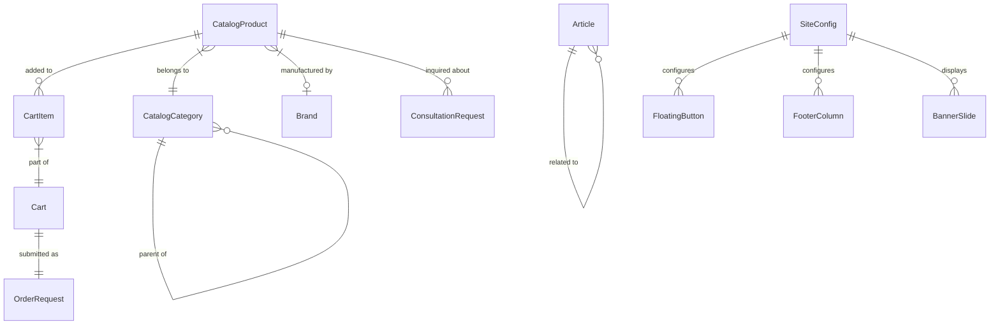

# Data Model: GRIP E-commerce & News Website

**Date**: 2026-05-23 | **Plan**: [plan.md](file:///Users/cynus/Desktop/grip-store/specs/002-ecommerce-news-website/plan.md)

## Existing Entities (Modified)

### CatalogProduct (extended)
**File**: [catalog.ts](file:///Users/cynus/Desktop/grip-store/src/domain/catalog.ts)

| Field | Type | New? | Notes |
|-------|------|------|-------|
| id | string | | Existing |
| name | string | | Existing |
| description | string \| null | | Existing |
| price | string | | Selling price |
| compareAtPrice | string \| null | | Original price (for discount display) |
| image | string \| null | | Primary image |
| images | string[] | ✅ | Thumbnail gallery images |
| category | string \| null | | Existing |
| categoryId | number \| null | ✅ | Category reference for tree navigation |
| brand | string \| null | ✅ | Brand name for filtering |
| brandId | number \| null | ✅ | Brand ID reference |
| sku | string \| null | ✅ | Stock Keeping Unit code |
| isHot | boolean | | Existing |
| isNew | boolean | ✅ | "Hàng mới về" label |
| isBestSeller | boolean | ✅ | "Bán chạy" label |
| isShared | boolean | | Existing |
| purchaseLimit | number \| null | | Existing |
| purchaseWarning | string \| null | | Existing |
| visibilityLevel | number | | Existing |
| stock | number | | Existing |
| sold | number | | Existing |
| rating | number | | Existing |
| reviewCount | number | | Existing |
| usageGuide | string \| null | ✅ | "Guide" tab content (markdown) |
| bundledGifts | string \| null | ✅ | Gift info text |
| discountPercent | number \| null | ✅ | Calculated: ((compareAt - price) / compareAt * 100) |

### CatalogCategory (extended)

| Field | Type | New? | Notes |
|-------|------|------|-------|
| id | number | | Existing (optional → required) |
| name | string | | Existing |
| icon | string \| null | | Existing |
| sortOrder | number | | Existing |
| parentId | number \| null | ✅ | Parent category for tree hierarchy |
| slug | string | ✅ | URL-friendly identifier |
| productCount | number | ✅ | Number of products in category |

### Admin (extended)

| Field | Type | New? | Notes |
|-------|------|------|-------|
| (All existing admin types preserved) | | | |
| ArticleCRUD | interface | ✅ | Admin article management types |
| BannerCRUD | interface | ✅ | Admin banner management types |
| FAQCrud | interface | ✅ | Admin FAQ management types |
| LeadManagement | interface | ✅ | Admin lead viewing types |
| SiteConfigCRUD | interface | ✅ | Admin site config types |

---

## New Entities

### Cart (`src/domain/cart.ts`)

| Field | Type | Notes |
|-------|------|-------|
| **CartItem** | | |
| productId | string | Reference to CatalogProduct |
| name | string | Denormalized for display |
| image | string \| null | Denormalized for display |
| price | string | Unit price at time of add |
| quantity | number | ≥ 1 |
| | | |
| **Cart** | | |
| items | CartItem[] | Array of cart items |
| totalItems | number | Sum of all quantities |
| totalAmount | number | Sum of (price × quantity) |
| | | |
| **CartAction** | | |
| type | 'ADD' \| 'REMOVE' \| 'UPDATE_QTY' \| 'CLEAR' | Reducer action type |
| payload | CartItem \| { productId: string } \| { productId: string; quantity: number } | Action data |

**State Transitions**: Empty → Items Added → Quantities Updated → Submitted as Order → Cleared
**Validation**: quantity ≥ 1, product must exist, total must be > 0 for order submission

---

### Article (`src/domain/article.ts`)

| Field | Type | Notes |
|-------|------|-------|
| id | number | Unique identifier |
| title | string | Article title |
| slug | string | URL-friendly identifier |
| excerpt | string \| null | Short description (for cards) |
| content | string | Full markdown content |
| featuredImage | string \| null | Cover image URL |
| publishDate | string | ISO date string |
| author | string \| null | Author name |
| tags | string[] | Article tags |
| isPublished | boolean | Publication status |
| | | |
| **ArticleListResponse** | | |
| items | Article[] | Paginated article list |
| page | number | Current page |
| total | number | Total article count |

---

### Lead (`src/domain/lead.ts`)

| Field | Type | Notes |
|-------|------|-------|
| **ConsultationRequest** | | |
| name | string | Customer full name |
| phone | string | Phone number |
| email | string \| null | Optional email |
| message | string | Inquiry message |
| productId | string \| null | Product context (if from product page) |
| sourcePage | string | Page where form was submitted |
| | | |
| **LeadResponse** | | |
| id | number | Lead ID |
| status | 'new' \| 'contacted' \| 'closed' | Follow-up status |
| createdAt | string | Submission timestamp |

---

### Banner (`src/domain/banner.ts`)

| Field | Type | Notes |
|-------|------|-------|
| **BannerSlide** | | |
| id | number | Unique identifier |
| image | string | Banner image URL |
| title | string \| null | Overlay title text |
| subtitle | string \| null | Overlay subtitle text |
| ctaText | string \| null | CTA button label |
| ctaLink | string \| null | CTA button target URL |
| sortOrder | number | Display order |
| isActive | boolean | Active/inactive toggle |

---

### FAQEntry (`src/domain/faq.ts`)

| Field | Type | Notes |
|-------|------|-------|
| id | number | Unique identifier |
| question | string | FAQ question |
| answer | string | FAQ answer (supports markdown) |
| sortOrder | number | Display order |
| isActive | boolean | Active/inactive toggle |
| | | |
| **FAQResponse** | | |
| items | FAQEntry[] | All active FAQ entries |

---

### SiteConfig (`src/domain/site-config.ts`)

| Field | Type | Notes |
|-------|------|-------|
| **FloatingButton** | | |
| type | 'zalo' \| 'messenger' \| 'hotline' \| 'scrollTop' | Button type |
| enabled | boolean | Show/hide toggle |
| link | string \| null | Target URL/phone number |
| label | string \| null | Tooltip label |
| | | |
| **FooterColumn** | | |
| title | string | Column heading |
| links | Array<{ label: string; href: string }> | Navigation links |
| | | |
| **SiteConfig** | | |
| shopName | string | Business name |
| shopLogo | string \| null | Logo image URL |
| shopDescription | string \| null | Business tagline |
| stickyBarAddress | string \| null | Top bar address text |
| stickyBarHotline | string \| null | Top bar hotline number |
| floatingButtons | FloatingButton[] | Floating action button config |
| footerColumns | FooterColumn[] | Footer navigation columns |
| footerCopyright | string \| null | Copyright text |
| socialLinks | Record<string, string> | Social media links |
| mapEmbedUrl | string \| null | Google Maps embed URL |
| aboutContent | string \| null | About page markdown |
| aboutGallery | string[] | About page image gallery |
| homepageBannerCount | number | Number of hero banners to show |
| homepageNewsCount | number | Number of news items on homepage |

---

### Brand (`src/domain/brand.ts` — or extend in catalog.ts)

| Field | Type | Notes |
|-------|------|-------|
| id | number | Unique identifier |
| name | string | Brand name |
| slug | string | URL-friendly identifier |
| productCount | number | Number of products by this brand |

---

## Entity Relationships

