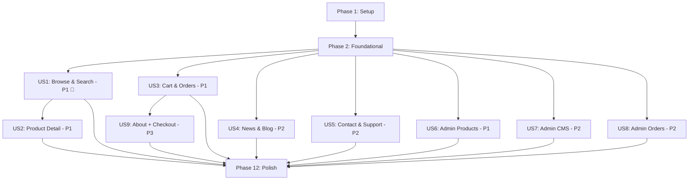

# Tasks: GRIP E-commerce & News Website

**Input**: Design documents from `/specs/002-ecommerce-news-website/`

**Prerequisites**: plan.md ✅, spec.md ✅, research.md ✅, data-model.md ✅

**Tests**: Not explicitly requested in spec. Tests omitted. Build + lint + import guards per Constitution Principle III.

**Organization**: Tasks grouped by user story (US1–US9) to enable independent implementation and testing.

## Format: `[ID] [P?] [Story] Description`

- **[P]**: Can run in parallel (different files, no dependencies)
- **[Story]**: Which user story this task belongs to (e.g., US1, US2, US3)
- Include exact file paths in descriptions

---

## Phase 1: Setup (Shared Infrastructure)

**Purpose**: Project initialization, design system updates, new dependencies

- [x] T001 Install new dependencies: `embla-carousel-react`, `embla-carousel-autoplay`, `@radix-ui/react-slider`, `@radix-ui/react-tabs`, `@radix-ui/react-accordion`, `@radix-ui/react-navigation-menu` via npm
- [x] T002 [P] Configure Inter font via `next/font/google` in `src/app/layout.tsx` with weights 400, 500, 600, 700, 800
- [x] T003 [P] Update `src/app/globals.css` — add GRIP brand color tokens (warm gold/brass primary hue ~45), typography scale matching Figma (12/14/16/20/28px), new utility classes for section spacing
- [x] T004 [P] Create Shadcn UI primitive `src/components/ui/carousel.tsx` wrapping Embla Carousel with autoplay support
- [x] T005 [P] Create Shadcn UI primitive `src/components/ui/tabs.tsx` using `@radix-ui/react-tabs`
- [x] T006 [P] Create Shadcn UI primitive `src/components/ui/slider.tsx` using `@radix-ui/react-slider` for dual-thumb price range
- [x] T007 [P] Create Shadcn UI primitive `src/components/ui/accordion.tsx` using `@radix-ui/react-accordion` for FAQ
- [x] T008 [P] Create Shadcn UI primitive `src/components/ui/breadcrumb.tsx` for page navigation breadcrumbs
- [x] T009 [P] Create Shadcn UI primitive `src/components/ui/skeleton.tsx` for loading states

---

## Phase 2: Foundational (Blocking Prerequisites)

**Purpose**: Domain types, API adapters, hooks, and context providers shared across ALL user stories

**⚠️ CRITICAL**: No user story work can begin until this phase is complete

### Domain Layer

- [x] T010 [P] Extend `src/domain/catalog.ts` — add `images`, `categoryId`, `brand`, `brandId`, `sku`, `isNew`, `isBestSeller`, `usageGuide`, `bundledGifts`, `discountPercent` fields to `CatalogProduct`; add `parentId`, `slug`, `productCount` to `CatalogCategory`
- [x] T011 [P] Create `src/domain/cart.ts` — define `CartItem`, `Cart`, `CartAction` types and cart state shape
- [x] T012 [P] Create `src/domain/article.ts` — define `Article`, `ArticleListResponse` types
- [x] T013 [P] Create `src/domain/lead.ts` — define `ConsultationRequest`, `LeadResponse` types
- [x] T014 [P] Create `src/domain/banner.ts` — define `BannerSlide` type
- [x] T015 [P] Create `src/domain/faq.ts` — define `FAQEntry`, `FAQResponse` types
- [x] T016 [P] Create `src/domain/site-config.ts` — define `FloatingButton`, `FooterColumn`, `SiteConfig` types
- [x] T017 [P] Create `src/domain/brand.ts` — define `Brand` type with id, name, slug, productCount

### Adapter Layer

- [x] T018 [P] Update `src/adapters/api/catalog.api.ts` — add `getBrands()`, `getCategoryTree()` endpoints; update `normalizeProduct()` for new fields
- [x] T019 [P] Create `src/adapters/api/cart.api.ts` — implement `submitOrderRequest()` endpoint (cart is client-side, only order submission hits API)
- [x] T020 [P] Create `src/adapters/api/articles.api.ts` — implement `getArticles()`, `getArticle(slug)`, `getLatestArticles(count)` endpoints
- [x] T021 [P] Create `src/adapters/api/leads.api.ts` — implement `submitConsultation(data)` endpoint
- [x] T022 [P] Create `src/adapters/api/banners.api.ts` — implement `getActiveBanners()` endpoint
- [x] T023 [P] Create `src/adapters/api/faq.api.ts` — implement `getFAQEntries()` endpoint
- [x] T024 [P] Create `src/adapters/api/site-config.api.ts` — implement `getSiteConfig()` endpoint
- [x] T025 [P] Create `src/adapters/api/brands.api.ts` — implement `getBrands()` endpoint

### Application Layer

- [x] T026 [P] Create `src/application/hooks/useBanners.ts` — SWR hook for hero banner data
- [x] T027 [P] Create `src/application/hooks/useArticles.ts` — SWR hooks for article listing and detail
- [x] T028 [P] Create `src/application/hooks/useLeads.ts` — mutation hook for consultation form submission
- [x] T029 [P] Create `src/application/hooks/useFAQ.ts` — SWR hook for FAQ entries
- [x] T030 [P] Create `src/application/hooks/useSiteConfig.ts` — SWR hook for site-wide configuration
- [x] T031 [P] Create `src/application/hooks/useBrands.ts` — SWR hook for brand listing
- [x] T032 [P] Create `src/application/hooks/useCart.ts` — hook wrapping CartContext for cart operations
- [x] T033 Create `src/application/context/CartContext.tsx` — React Context + useReducer for cart state with localStorage persistence

### i18n

- [x] T034 [P] Create `src/locales/vi.ts` — Vietnamese translations for all existing + new i18n keys (homepage sections, product labels, cart, articles, contact, footer, USPs)
- [x] T035 [P] Update `src/locales/en.ts` (or existing locale file) — add all new i18n keys for new features

**Checkpoint**: Foundation ready — all domain types, adapters, hooks, and contexts available. User story implementation can now begin in parallel.

---

## Phase 3: User Story 1 — Browse & Search Products (Priority: P1) 🎯 MVP

**Goal**: Customers can browse homepage, navigate categories, search products, filter/sort on listing page, view product cards with complete info.

**Independent Test**: Navigate homepage → click category → product listing with filters/sort → verify product cards show image, name, price, discount, badges, CTA.

### Layout Components (shared, built here first)

- [x] T036 [US1] Create `src/components/layout/sticky-bar.tsx` — top bar with address + hotline from site config (Figma `8:500`: 32px, SVN-Gilroy SemiBold 12px)
- [x] T037 [US1] Create `src/components/layout/navbar.tsx` — main navigation bar with logo, category links (Cabinet ×4 from Figma), search input, cart icon, user avatar/login (Figma `8:507`: 72px, 1190px content)
- [x] T038 [US1] Create `src/components/layout/mega-footer.tsx` — multi-column footer with CTA banner ("GRIP - TỔNG KHO TAY NẮM VIỆT NAM"), sub-menus, social links, copyright (Figma `I8:619;1:397` + `I8:619;138:5177`)
- [x] T039 [US1] Create `src/components/layout/floating-buttons.tsx` — fixed-position Zalo/Messenger/Hotline/scroll-to-top buttons with Framer Motion entrance animation, config from `useSiteConfig()`
- [x] T040 [US1] Update `src/app/layout.tsx` — replace `SiteHeader`/`SiteFooter` with sticky-bar + navbar + mega-footer + floating-buttons; add Inter font provider

### Homepage Sections

- [x] T041 [P] [US1] Create `src/components/home/hero-banner.tsx` — full-width Embla carousel with auto-play, navigation dots, CTA overlay (Figma `8:508`: 668px height, banner data from `useBanners()`)
- [x] T042 [P] [US1] Create `src/components/home/category-rail.tsx` — horizontal scrollable category icon cards linking to `/products?category=X` (Figma `8:509`: 5 category cards 200×235px each with thumbnail + name + "Khám phá" CTA)
- [x] T043 [P] [US1] Create `src/components/home/product-section.tsx` — reusable product grid section with section title ("SẢN PHẨM NỔI BẬT", "TAY NẮM CAO CẤP"), "Xem tất cả" link, and 5-column product card grid (Figma `20:244`: 553px)
- [x] T044 [P] [US1] Create `src/components/home/usp-section.tsx` — 4 USP badge cards ("Vận chuyển miễn phí", "Ưu đãi khách hàng VIP", "Chứng nhận chất lượng", "HOTLINE") in a horizontal row (Figma `27:1275`: 224px)
- [x] T045 [P] [US1] Create `src/components/home/news-section.tsx` — "TIN TỨC MỚI NHẤT" section with 4 article cards showing image, title, date, excerpt, CTA button (Figma `27:559`: 507px)
- [x] T046 [P] [US1] Create `src/components/home/cta-banner.tsx` — pre-footer CTA banner with hotline number, Zalo, Facebook buttons (Figma `I8:619;138:5177`: 127px)
- [x] T047 [P] [US1] Create `src/components/home/shop-by-color.tsx` — color-based product browsing section (Figma `47:1638`: 633px)

### Shared Product Components

- [x] T048 [P] [US1] Create `src/components/product/product-card.tsx` — product card with image, "Bán chạy"/"Hàng mới về" badges, SKU, name, price (strikethrough + sale price), "Xem chi tiết"/"Khám phá" CTA button (Figma product card: 200×327px, border-radius 12px)
- [x] T049 [P] [US1] Create `src/components/product/product-sidebar.tsx` — category tree sidebar for listing page using recursive rendering of `CatalogCategory` with `parentId` hierarchy
- [x] T050 [P] [US1] Create `src/components/product/product-filters.tsx` — price range dual-thumb slider with "Lọc" button, brand checkboxes with product count, sort dropdown (Name A-Z/Z-A, Price ↑↓, Newest, Oldest)
- [x] T051 [P] [US1] Create `src/components/product/quick-view.tsx` — Radix Dialog modal showing product summary (image, name, price, description, CTA) without page navigation

### Pages

- [x] T052 [P] [US1] Rewrite `src/components/home-content.tsx` — combine all homepage sections (`HeroBanner`, `CategoryRail`, `ProductSection` x2, `USPSection`, `ShopByColor`, `NewsSection`, `CTABanner`) passing data from hooks
- [x] T053 [P] [US1] Update `src/app/page.tsx` — remove old content, import and render `HomeContent`
- [x] T054 [P] [US1] Create `src/app/products/page.tsx` — Product Listing Page layout with sidebar and grid, fetching data via `useCatalog` (Figma `I8:615;135:5044`)
- [x] T055 [P] [US1] Update `src/components/mobile-nav.tsx` — mobile bottom navigation with Home, Products, Articles, Contact icons; update icon set

**Checkpoint**: Homepage fully redesigned per Figma. Product listing page with filters operational. Core product browsing flow complete.

---

## Phase 4: User Story 2 — View Product Details & Request Consultation (Priority: P1)

**Goal**: Customers see full product details with image gallery, tabbed content (details/guide/reviews), and can submit consultation request.

**Independent Test**: Navigate to product detail page → browse image gallery → switch tabs → fill and submit consultation form → verify success confirmation.

- [x] T056 [P] [US2] Create `src/components/product/product-gallery.tsx` — main image display with thumbnail strip, click to select, zoom-on-hover, Next.js Image optimization
- [x] T057 [P] [US2] Create `src/components/product/product-tabs.tsx` — Radix Tabs for "Chi tiết sản phẩm", "Hướng dẫn sử dụng", "Đánh giá" (review count badge) content areas
- [x] T058 [P] [US2] Create `src/components/product/consultation-form.tsx` — form with name, phone, email, message fields; submits via `useLeads()` hook; success toast notification
- [x] T059 [P] [US2] Create `src/components/layout/breadcrumbs.tsx` — breadcrumb wrapper component (Home > Category > Product Name)
- [x] T060 [US2] Create `src/app/products/[id]/page.tsx` — product detail page composing: breadcrumbs, gallery, product info (name, brand, SKU, price, discount badge, savings, bundled gifts), tabs, consultation form, related products
- [x] T061 [US2] Update `src/application/hooks/useProduct.ts` — extend to fetch full product detail including gallery images, usage guide, reviews

**Checkpoint**: Full product detail page operational with gallery, tabs, and consultation form.

---

## Phase 5: User Story 3 — Shopping Cart & Order Request (Priority: P1)

**Goal**: Customers can add products to cart from any page, view/edit cart, and submit order request.

**Independent Test**: Add products from homepage + listing + detail page → view cart → change quantities/remove items → submit order → verify confirmation.

- [x] T062 [P] [US3] Create `src/components/cart/add-to-cart-button.tsx` — button component with quantity selector, adds item to CartContext, shows toast confirmation
- [x] T063 [P] [US3] Create `src/components/cart/cart-item.tsx` — cart item row with image, name, price, quantity selector (±), remove button, line total
- [x] T064 [P] [US3] Create `src/components/cart/cart-summary.tsx` — cart totals display (subtotal, item count), checkout/submit order button (disabled when cart empty)
- [x] T065 [US3] Create `src/components/cart/cart-drawer.tsx` — Radix Sheet slide-out panel triggered from navbar cart icon, composing cart-item list + cart-summary
- [x] T066 [US3] Create `src/app/cart/page.tsx` — full cart page with item list, quantity editing, remove, totals, and "Gửi đơn hàng" (submit order) CTA
- [x] T067 [US3] Integrate add-to-cart button into `src/components/product/product-card.tsx` and `src/app/products/[id]/page.tsx`
- [x] T068 [US3] Integrate cart icon with item count badge into `src/components/layout/navbar.tsx`

**Checkpoint**: Full cart flow operational. Add-to-cart from any product surface, cart management, order submission.

---

## Phase 6: User Story 4 — Read News & Blog Content (Priority: P2)

**Goal**: Customers can browse news articles in grid layout, read full articles.

**Independent Test**: Navigate to news listing → see article grid with images/titles/excerpts → click article → read full content.

- [x] T069 [P] [US4] Create `src/components/article/article-card.tsx` — article card with featured image (200×260px from Figma), title, date ("24/02/2026"), excerpt, "Khám phá"/"Đọc thêm" CTA button
- [ ] T070 [P] [US4] Create `src/components/article/article-content.tsx` — full article body rendered with `react-markdown` + `@tailwindcss/typography` prose styles
- [ ] T071 [P] [US4] Create `src/components/article/related-articles.tsx` — related articles sidebar/section with article cards
- [ ] T072 [US4] Create `src/app/articles/page.tsx` — article listing page with grid layout, pagination, breadcrumbs
- [ ] T073 [US4] Create `src/app/articles/[slug]/page.tsx` — full article page with featured image, title, date, content, related articles

**Checkpoint**: News/blog section fully operational with listing and detail pages.

---

## Phase 7: User Story 5 — Contact & Support (Priority: P2)

**Goal**: Customers can view company info, see map, submit consultation form, browse FAQ, use floating support buttons.

**Independent Test**: Navigate to Contact page → see company info + map → submit contact form → verify success → expand FAQ items → click floating Zalo button.

- [ ] T074 [P] [US5] Create `src/components/contact/contact-form.tsx` — consultation form with name, phone, email, message fields; validates required fields inline; submits via `useLeads()` hook
- [ ] T075 [P] [US5] Create `src/components/contact/contact-map.tsx` — Google Maps iframe embed with configurable URL from site config
- [ ] T076 [P] [US5] Create `src/components/contact/faq-section.tsx` — Radix Accordion rendering FAQ entries from `useFAQ()` hook, supports markdown answers
- [ ] T077 [US5] Create `src/app/contact/page.tsx` — contact page composing: company info text, map, consultation form, FAQ section, breadcrumbs

**Checkpoint**: Contact page operational with all interactive elements.

---

## Phase 8: User Story 6 — Admin Manages Product Catalog (Priority: P1)

**Goal**: Admin can CRUD products with all new fields, manage category hierarchy with parent-child tree.

**Independent Test**: Login as admin → create product with images/prices/category/brand/SKU/labels → edit product → assign to category → verify appears on public site → delete product → verify removed.

- [ ] T078 [P] [US6] Update `src/domain/admin.ts` — add admin types for product CRUD with new fields (images gallery, brand, SKU, labels, usage guide, bundled gifts), category CRUD with parentId
- [ ] T079 [P] [US6] Update `src/adapters/api/admin.api.ts` — add endpoints for product CRUD with new fields, category tree CRUD with parent-child hierarchy
- [ ] T080 [US6] Update `src/application/hooks/useAdmin.ts` — add hooks for extended product management and category tree management
- [ ] T081 [US6] Update admin product form in `src/components/admin/` — add fields for image gallery upload, brand selector, SKU input, label toggles (Hot/New/Best Seller), usage guide editor, bundled gifts text
- [ ] T082 [US6] Update admin category management in `src/components/admin/` — add parent category selector for hierarchy, slug auto-generation

**Checkpoint**: Admin can fully manage extended product catalog and category hierarchy.

---

## Phase 9: User Story 7 — Admin Manages CMS Content & Homepage (Priority: P2)

**Goal**: Admin can manage blog posts, banners, homepage blocks, floating buttons, About page, theme color.

**Independent Test**: Login as admin → create blog post → verify on public site → upload banner → verify on homepage → configure floating buttons → verify on public site.

- [ ] T083 [P] [US7] Update `src/domain/admin.ts` — add admin types for article CRUD, banner CRUD, site config management, FAQ CRUD
- [ ] T084 [P] [US7] Update `src/adapters/api/admin.api.ts` — add endpoints for article CRUD, banner CRUD, FAQ CRUD, site config update
- [ ] T085 [US7] Update `src/application/hooks/useAdmin.ts` — add hooks for article management, banner management, FAQ management, site config management
- [ ] T086 [US7] Create admin article editor page in `src/components/admin/` — rich text editor for article content, featured image upload, title, excerpt, tags, publish toggle
- [ ] T087 [US7] Create admin banner manager page in `src/components/admin/` — banner image upload, title/subtitle/CTA fields, ordering, active toggle
- [ ] T088 [US7] Create admin FAQ manager page in `src/components/admin/` — question/answer editor, ordering, active toggle
- [ ] T089 [US7] Create admin site config page in `src/components/admin/` — floating button settings (enable/disable, URLs), footer content, social links, homepage block configuration, theme color picker

**Checkpoint**: Admin CMS fully operational for content, banners, FAQ, and site configuration.

---

## Phase 10: User Story 8 — Admin Manages Orders & Leads (Priority: P2)

**Goal**: Admin can view order requests and consultation submissions, update status.

**Independent Test**: Submit order + consultation on public site → login as admin → verify both appear in admin panel → update status → verify status persists.

- [ ] T090 [P] [US8] Update `src/domain/admin.ts` — add admin types for lead management (list, detail, status update)
- [ ] T091 [P] [US8] Update `src/adapters/api/admin.api.ts` — add endpoints for lead listing, detail, status update
- [ ] T092 [US8] Update `src/application/hooks/useAdmin.ts` — add hooks for lead management
- [ ] T093 [US8] Create admin leads list page in `src/components/admin/` — table of consultation submissions with status, date, source, customer info
- [ ] T094 [US8] Create admin lead detail view in `src/components/admin/` — full lead info with status update dropdown

**Checkpoint**: Admin can view and manage all customer inquiries and order requests.

---

## Phase 11: User Story 9 — About Us Page + Checkout + Thank You (Priority: P3)

**Goal**: About Us page with rich content + gallery; Checkout page; Thank You confirmation page.

**Independent Test**: Navigate to About page → see text + gallery → Navigate to checkout → verify form → Submit → see Thank You page.

- [ ] T095 [P] [US9] Create `src/app/about/page.tsx` — About Us page with markdown content from site config, company photo gallery (lightbox), related articles section
- [ ] T096 [P] [US9] Create `src/app/checkout/page.tsx` — checkout page with order summary, customer info form (name, phone, email, address, notes), submit order request (Figma `117:4153` Checkout-page design)
- [ ] T097 [P] [US9] Create `src/app/thank-you/page.tsx` — order confirmation page with order ID, summary, "Tiếp tục mua hàng" CTA (Figma `125:4924` Thank-you-page design)

**Checkpoint**: All public pages operational. Full user journey complete.

---

## Phase 12: Polish & Cross-Cutting Concerns

**Purpose**: Responsive design, SEO, performance, accessibility, final validation

- [ ] T098 [P] Responsive testing — verify all pages at 1440px (desktop), 768px (tablet), 375px (mobile) viewports; fix layout issues
- [ ] T099 [P] Mobile homepage layout — adapt hero banner, category rail (horizontal scroll), product grids (2-column), USP section (2×2 grid) for mobile (Figma `27:1404` mobile design)
- [ ] T100 [P] SEO optimization — add `<title>`, `<meta description>`, Open Graph tags, proper `<h1>` per page, image `alt` tags, structured data (Product, Article, FAQ, Organization schemas)
- [ ] T101 [P] SEO — generate `sitemap.xml` and `robots.txt` in `public/`
- [ ] T102 [P] Performance — verify image lazy loading for below-fold images, add `priority` to above-fold hero images, verify code splitting per route
- [ ] T103 [P] Performance — configure SWR with appropriate `dedupingInterval` and `revalidateOnFocus` for all hooks to prevent redundant API calls
- [ ] T104 [P] Accessibility audit — verify ARIA attributes on carousel, tabs, accordion, dialog, dropdown; verify keyboard navigation; verify focus management in cart drawer and quick view modal
- [ ] T105 [P] Update `README.md` — document new features, updated architecture, deployment instructions
- [ ] T106 Run `npm run lint` — fix all ESLint errors (Constitution Principle III gate 1)
- [ ] T107 Run `npm run build` — fix all build errors and warnings (Constitution Principle III gate 2)
- [ ] T108 Run import guard checks — verify zero results for `grep -rn "from.*@/lib/db" src/`, `grep -rn "'use server'" src/`, and all other guards (Constitution Principle III gate 3)
- [ ] T109 Smoke test all critical flows — homepage browse, product listing filter/sort, product detail, add-to-cart, order submission, article read, contact form, admin CRUD (Constitution Principle III gate 4)

---

## Dependencies & Execution Order

### Phase Dependencies

- **Setup (Phase 1)**: No dependencies — can start immediately
- **Foundational (Phase 2)**: Depends on Phase 1 completion — **BLOCKS** all user stories
- **US1 (Phase 3)**: Depends on Phase 2 — builds layout + homepage + product listing
- **US2 (Phase 4)**: Depends on Phase 2 + product-card from US1 (T048) — product detail page
- **US3 (Phase 5)**: Depends on Phase 2 + CartContext (T033) — can start as soon as Phase 2 completes
- **US4 (Phase 6)**: Depends on Phase 2 — independent of US1-3
- **US5 (Phase 7)**: Depends on Phase 2 — independent of US1-4
- **US6 (Phase 8)**: Depends on Phase 2 — independent of US1-5 (admin side)
- **US7 (Phase 9)**: Depends on Phase 2 — independent of US1-6 (admin CMS)
- **US8 (Phase 10)**: Depends on Phase 2 + leads API from Phase 2 (T021)
- **US9 (Phase 11)**: Depends on Phase 2 + CartContext (T033) for checkout
- **Polish (Phase 12)**: Depends on all desired user stories being complete

### User Story Dependencies



### Within Each User Story

- Domain types before adapters
- Adapters before hooks
- Hooks before components
- Components before pages
- Core implementation before integration
- Story complete before moving to next priority

### Parallel Opportunities

- All Phase 1 tasks T004–T009 can run in parallel (different UI primitive files)
- All Phase 2 domain tasks T010–T017 can run in parallel (different domain files)
- All Phase 2 adapter tasks T018–T025 can run in parallel (different adapter files)
- All Phase 2 hook tasks T026–T033 can run in parallel (different hook files)
- US1 homepage section components T041–T047 can run in parallel (different component files)
- US1 product components T048–T051 can run in parallel (different component files)
- US4, US5, US6, US7, US8 can all run in parallel after Phase 2 (different feature areas)

---

## Parallel Example: Phase 2 Foundation

```bash
# Launch all domain types in parallel:
Task: "Create src/domain/cart.ts"
Task: "Create src/domain/article.ts"
Task: "Create src/domain/lead.ts"
Task: "Create src/domain/banner.ts"
Task: "Create src/domain/faq.ts"
Task: "Create src/domain/site-config.ts"
Task: "Create src/domain/brand.ts"

# Then launch all adapters in parallel:
Task: "Create src/adapters/api/articles.api.ts"
Task: "Create src/adapters/api/leads.api.ts"
Task: "Create src/adapters/api/banners.api.ts"
Task: "Create src/adapters/api/faq.api.ts"
Task: "Create src/adapters/api/site-config.api.ts"
Task: "Create src/adapters/api/brands.api.ts"
```

## Parallel Example: User Story 1 Homepage

```bash
# Launch all homepage sections in parallel:
Task: "Create src/components/home/hero-banner.tsx"
Task: "Create src/components/home/category-rail.tsx"
Task: "Create src/components/home/product-section.tsx"
Task: "Create src/components/home/usp-section.tsx"
Task: "Create src/components/home/news-section.tsx"
Task: "Create src/components/home/cta-banner.tsx"
Task: "Create src/components/home/shop-by-color.tsx"
```

---

## Implementation Strategy

### MVP First (User Story 1 Only)

1. Complete Phase 1: Setup (T001–T009)
2. Complete Phase 2: Foundational (T010–T035) — **CRITICAL**
3. Complete Phase 3: US1 Browse & Search (T036–T055)
4. **STOP and VALIDATE**: Homepage displays per Figma, product listing works with filters
5. Deploy/demo if ready — users can browse products

### Incremental Delivery

1. **Setup + Foundation** → Infrastructure ready
2. **Add US1** (Browse & Search) → Homepage + listing functional → **Deploy (MVP!)**
3. **Add US2** (Product Detail) → Full product pages → Deploy
4. **Add US3** (Cart & Orders) → Full purchase flow → Deploy
5. **Add US4+US5** (News + Contact) → Content pages → Deploy
6. **Add US6+US7+US8** (Admin) → Full admin panel → Deploy
7. **Add US9** (About + Checkout + Thank You) → Complete site → Deploy
8. **Polish** → SEO, responsive, accessibility, performance → **Production Release**

### Parallel Team Strategy

With multiple developers after Phase 2:

- **Developer A**: US1 (Homepage + Listing) → US2 (Product Detail)
- **Developer B**: US3 (Cart) → US9 (Checkout + Thank You)
- **Developer C**: US4 (News) + US5 (Contact) + US9 (About)
- **Developer D**: US6 (Admin Products) → US7 (Admin CMS) → US8 (Admin Leads)

---

## Notes

- [P] tasks = different files, no dependencies
- [Story] label maps task to specific user story for traceability
- Each user story is independently completable and testable
- Commit after each task or logical group
- Stop at any checkpoint to validate story independently
- All Figma references use node IDs from `figma-mcp-go` scan results
- Vietnamese text content is sourced directly from Figma text nodes
- Constitution Principle III test gates are mandatory before merge (Phase 12: T106–T109)
