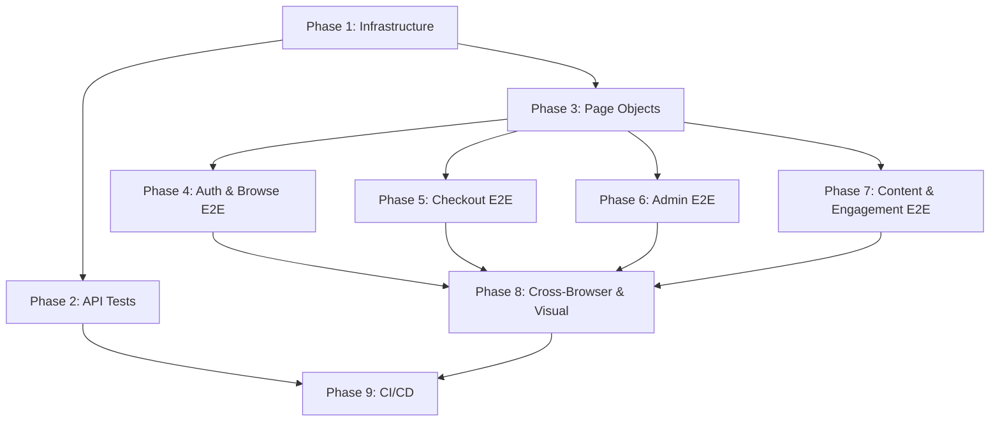

# Implementation Plan: Playwright Automated Testing (E2E + API)

**Branch**: `003-playwright-auto-test` | **Date**: 2025-07-27 | **Spec**: [spec.md](./spec.md)

**Input**: Feature specification from `/specs/003-playwright-auto-test/spec.md`

## Summary

Implement comprehensive Playwright-based E2E and API testing for the Grip Store e-commerce platform. The solution extends the existing Playwright infrastructure (auth page object, fixtures, API client) to cover all 54+ API endpoints and ~30 E2E user flows across 7 domains (auth, browse, checkout, admin, content, engagement, API). Tests execute across 4 browser targets with a dedicated API-only project for fast feedback. Architecture follows Page Object Model with centralized locators, shared fixtures, and API-based test data management via the Go backend.

## Technical Context

**Language/Version**: TypeScript 5.x (strict mode)

**Primary Dependencies**: `@playwright/test` (devDependency), `dotenv` (test env config)

**Storage**: N/A — tests interact with Go backend API; no direct DB access

**Testing**: Playwright Test runner with custom fixtures, HTML + GitHub reporters

**Target Platform**: macOS/Linux CI, headless browsers (Chromium, Firefox, WebKit, Mobile Chrome)

**Project Type**: Test suite (devDependency-only, no production code)

**Performance Goals**: Full suite completes in <10 minutes on CI (NFR-005)

**Constraints**: No direct database access; OAuth providers mocked; Go backend must be running; all test data managed via API

**Scale/Scope**: ~54 API tests + ~30 E2E tests across 4 browser targets; 7 test domains

## Constitution Check

*GATE: Must pass before Phase 0 research. Re-check after Phase 1 design.*

| Principle | Status | Notes |
|-----------|--------|-------|
| I. Clean Architecture Boundaries | ✅ Pass | Tests are in `playwright/` outside src; no production code coupling |
| II. Frontend Contract Stability | ✅ Pass | Tests validate contracts, don't create new ones |
| III. Test-Gate Discipline | ✅ Pass | This feature IS the test gate implementation |
| IV. Type-Safe API Communication | ✅ Pass | All API helpers use typed request/response shapes |
| V. UX Consistency | ✅ Pass | E2E tests validate UX consistency |
| VI. Performance Budgets | ✅ Pass | NFR-005 enforces <10min CI budget |
| VII. Migration Completeness | ✅ Pass | Tests verify migrated features work correctly |

## Project Structure

### Documentation (this feature)

```text
specs/003-playwright-auto-test/
├── plan.md              # This file
├── spec.md              # Feature specification
├── research.md          # Architecture research & decisions
├── data-model.md        # Test infrastructure entities & patterns
├── contracts/           # Interface contracts (TypeScript types)
│   ├── fixtures.d.ts
│   └── api-helpers.d.ts
├── checklists/          # Verification checklists
└── tasks.md             # Implementation tasks (via /speckit-tasks)
```

### Source Code (repository root)

```text
playwright/
├── specs/                       # Test specifications (testDir in config)
│   ├── api/                     # API-only contract tests
│   │   ├── auth.api.spec.ts
│   │   ├── catalog.api.spec.ts
│   │   ├── checkout.api.spec.ts
│   │   ├── orders.api.spec.ts
│   │   ├── profile.api.spec.ts
│   │   ├── wishlist.api.spec.ts
│   │   ├── reviews.api.spec.ts
│   │   ├── notifications.api.spec.ts
│   │   └── admin.api.spec.ts
│   ├── auth/                    # Auth E2E (existing login.spec.ts)
│   │   ├── login.spec.ts       (existing)
│   │   └── signup.spec.ts
│   ├── browse/                  # Product browsing E2E
│   │   ├── homepage.spec.ts
│   │   ├── product-list.spec.ts
│   │   ├── product-detail.spec.ts
│   │   └── search.spec.ts
│   ├── checkout/                # Cart & checkout E2E
│   │   ├── cart.spec.ts
│   │   └── order-flow.spec.ts
│   ├── admin/                   # Admin panel E2E
│   │   ├── products.spec.ts
│   │   ├── orders.spec.ts
│   │   └── settings.spec.ts
│   ├── content/                 # Content pages E2E
│   │   ├── articles.spec.ts
│   │   ├── about.spec.ts
│   │   └── contact.spec.ts
│   └── engagement/              # Wishlist, reviews, points E2E
│       ├── wishlist.spec.ts
│       ├── reviews.spec.ts
│       └── checkin.spec.ts
├── src/                         # Shared test infrastructure
│   ├── api-helpers/             # API client classes
│   │   ├── go-backend.client.ts (existing — extended with delete method)
│   │   ├── auth.api.ts
│   │   ├── catalog.api.ts
│   │   ├── checkout.api.ts
│   │   ├── orders.api.ts
│   │   ├── profile.api.ts
│   │   ├── engagement.api.ts
│   │   └── admin.api.ts
│   ├── fixtures/                # Playwright fixtures
│   │   ├── base-test.ts         (existing — extended with more page objects)
│   │   └── auth.setup.ts        # Global setup: save auth storageState
│   ├── locators/                # Centralized selectors
│   │   ├── auth.locators.ts     (existing)
│   │   ├── catalog.locators.ts
│   │   ├── cart.locators.ts
│   │   ├── checkout.locators.ts
│   │   ├── admin.locators.ts
│   │   ├── profile.locators.ts
│   │   ├── content.locators.ts
│   │   ├── engagement.locators.ts
│   │   └── index.ts             (existing — extended)
│   ├── objects/                  # Page Object Model classes
│   │   ├── auth.page.ts          (existing)
│   │   ├── homepage.page.ts
│   │   ├── product-list.page.ts
│   │   ├── product-detail.page.ts
│   │   ├── cart.page.ts
│   │   ├── checkout.page.ts
│   │   ├── orders.page.ts
│   │   ├── admin.page.ts
│   │   ├── profile.page.ts
│   │   ├── article.page.ts
│   │   ├── wishlist.page.ts
│   │   └── index.ts             (existing — extended)
│   └── helpers/                  # Utility functions
│       ├── test-data.ts          # Factories for test data
│       └── wait-helpers.ts       # Custom wait/retry utilities
├── .env.test                    # Test environment variables
├── reports/                     # HTML reports (gitignored)
└── test-results/                # Artifacts (gitignored)
```

**Structure Decision**: Evolve the existing `playwright/specs/` + `playwright/src/` pattern. The spec's TA-001 suggested `tests/` and `pages/` directories, but the established convention uses `specs/` (aligned with `playwright.config.ts testDir`) and `src/objects/` for page objects. Existing code works; renaming would break the current auth tests. The plan extends rather than replaces.

## Complexity Tracking

No constitution violations detected. All additions follow established patterns.

---

## Implementation Phases

### Phase 1: Infrastructure Foundation

**Goal**: Establish the testing infrastructure that all subsequent phases depend on.

| Task | Description | Files |
|------|-------------|-------|
| 1.1 | Update `playwright.config.ts` with `setup` and `api` projects, dependencies, storageState, env vars | `playwright.config.ts` |
| 1.2 | Create `.env.test` with test environment configuration | `playwright/.env.test` |
| 1.3 | Create `auth.setup.ts` global setup that logs in and saves storageState | `playwright/src/fixtures/auth.setup.ts` |
| 1.4 | Extend `base-test.ts` with new page object and API helper fixtures | `playwright/src/fixtures/base-test.ts` |
| 1.5 | Extend `GoBackendClient` with `delete()` method and typed responses | `playwright/src/api-helpers/go-backend.client.ts` |
| 1.6 | Create `src/helpers/test-data.ts` with test data factory functions | `playwright/src/helpers/test-data.ts` |
| 1.7 | Create `src/helpers/wait-helpers.ts` with custom wait utilities | `playwright/src/helpers/wait-helpers.ts` |

**Acceptance**: `npx playwright test --project=setup` runs without error; storageState file is written.

---

### Phase 2: API Test Suite

**Goal**: Cover all 54+ API endpoints with contract tests (no browser required).

| Task | Description | Files |
|------|-------------|-------|
| 2.1 | Create `AuthApiHelper` class | `playwright/src/api-helpers/auth.api.ts` |
| 2.2 | Create `CatalogApiHelper` class | `playwright/src/api-helpers/catalog.api.ts` |
| 2.3 | Create `CheckoutApiHelper` class | `playwright/src/api-helpers/checkout.api.ts` |
| 2.4 | Create `OrdersApiHelper` class | `playwright/src/api-helpers/orders.api.ts` |
| 2.5 | Create `ProfileApiHelper` class | `playwright/src/api-helpers/profile.api.ts` |
| 2.6 | Create `EngagementApiHelper` class (wishlist, reviews, notifications) | `playwright/src/api-helpers/engagement.api.ts` |
| 2.7 | Create `AdminApiHelper` class | `playwright/src/api-helpers/admin.api.ts` |
| 2.8 | Write `specs/api/auth.api.spec.ts` (refresh, logout, me) | `playwright/specs/api/auth.api.spec.ts` |
| 2.9 | Write `specs/api/catalog.api.spec.ts` (products, search, categories, settings, announcement) | `playwright/specs/api/catalog.api.spec.ts` |
| 2.10 | Write `specs/api/checkout.api.spec.ts` (create order, payment-orders, status, cancel) | `playwright/specs/api/checkout.api.spec.ts` |
| 2.11 | Write `specs/api/orders.api.spec.ts` (list, detail, status, cancel, refund) | `playwright/specs/api/orders.api.spec.ts` |
| 2.12 | Write `specs/api/profile.api.spec.ts` (profile, email, notifications, points, checkin) | `playwright/specs/api/profile.api.spec.ts` |
| 2.13 | Write `specs/api/wishlist.api.spec.ts` (CRUD, vote) | `playwright/specs/api/wishlist.api.spec.ts` |
| 2.14 | Write `specs/api/reviews.api.spec.ts` (list, create, admin delete) | `playwright/specs/api/reviews.api.spec.ts` |
| 2.15 | Write `specs/api/notifications.api.spec.ts` (list, unread, read, clear) | `playwright/specs/api/notifications.api.spec.ts` |
| 2.16 | Write `specs/api/admin.api.spec.ts` (products, cards, orders, users, settings, categories, notifications, data) | `playwright/specs/api/admin.api.spec.ts` |

**Acceptance**: `npx playwright test --project=api` passes all endpoint tests with 200/201/204 assertions and response shape validation.

---

### Phase 3: Page Objects & Locators

**Goal**: Create POM classes and locator maps for all pages before writing E2E tests.

| Task | Description | Files |
|------|-------------|-------|
| 3.1 | Create `CatalogLocators` | `playwright/src/locators/catalog.locators.ts` |
| 3.2 | Create `CartLocators` | `playwright/src/locators/cart.locators.ts` |
| 3.3 | Create `CheckoutLocators` | `playwright/src/locators/checkout.locators.ts` |
| 3.4 | Create `AdminLocators` | `playwright/src/locators/admin.locators.ts` |
| 3.5 | Create `ProfileLocators` | `playwright/src/locators/profile.locators.ts` |
| 3.6 | Create `ContentLocators` | `playwright/src/locators/content.locators.ts` |
| 3.7 | Create `EngagementLocators` | `playwright/src/locators/engagement.locators.ts` |
| 3.8 | Update `src/locators/index.ts` barrel export | `playwright/src/locators/index.ts` |
| 3.9 | Create `HomepagePage` | `playwright/src/objects/homepage.page.ts` |
| 3.10 | Create `ProductListPage` | `playwright/src/objects/product-list.page.ts` |
| 3.11 | Create `ProductDetailPage` | `playwright/src/objects/product-detail.page.ts` |
| 3.12 | Create `CartPage` | `playwright/src/objects/cart.page.ts` |
| 3.13 | Create `CheckoutPage` | `playwright/src/objects/checkout.page.ts` |
| 3.14 | Create `OrdersPage` | `playwright/src/objects/orders.page.ts` |
| 3.15 | Create `AdminPage` | `playwright/src/objects/admin.page.ts` |
| 3.16 | Create `ProfilePage` | `playwright/src/objects/profile.page.ts` |
| 3.17 | Create `ArticlePage` | `playwright/src/objects/article.page.ts` |
| 3.18 | Create `WishlistPage` | `playwright/src/objects/wishlist.page.ts` |
| 3.19 | Update `src/objects/index.ts` barrel export | `playwright/src/objects/index.ts` |

**Acceptance**: All POM classes compile; imports resolve; barrel exports work.

---

### Phase 4: E2E Tests — Auth & Browse

**Goal**: Cover authentication and product browsing flows.

| Task | Description | Files |
|------|-------------|-------|
| 4.1 | Extend existing `login.spec.ts` with OAuth mock test + remember me | `playwright/specs/auth/login.spec.ts` |
| 4.2 | Create `signup.spec.ts` (registration flow, validation) | `playwright/specs/auth/signup.spec.ts` |
| 4.3 | Create `homepage.spec.ts` (hero, featured products, announcements) | `playwright/specs/browse/homepage.spec.ts` |
| 4.4 | Create `product-list.spec.ts` (grid, filters, pagination, sort) | `playwright/specs/browse/product-list.spec.ts` |
| 4.5 | Create `product-detail.spec.ts` (info, images, add to cart, reviews) | `playwright/specs/browse/product-detail.spec.ts` |
| 4.6 | Create `search.spec.ts` (search query, results, empty state) | `playwright/specs/browse/search.spec.ts` |

**Acceptance**: `npx playwright test specs/auth specs/browse --project=chromium` passes.

---

### Phase 5: E2E Tests — Checkout & Orders

**Goal**: Cover cart, checkout, and order management flows.

| Task | Description | Files |
|------|-------------|-------|
| 5.1 | Create `cart.spec.ts` (add/remove items, quantity, totals) | `playwright/specs/checkout/cart.spec.ts` |
| 5.2 | Create `order-flow.spec.ts` (complete purchase, payment redirect, confirmation) | `playwright/specs/checkout/order-flow.spec.ts` |
| 5.3 | Create `orders.spec.ts` (if needed for E2E order management) | Covered by order-flow.spec.ts |

**Acceptance**: `npx playwright test specs/checkout --project=chromium` passes.

---

### Phase 6: E2E Tests — Admin Panel

**Goal**: Cover admin CRUD operations.

| Task | Description | Files |
|------|-------------|-------|
| 6.1 | Create `products.spec.ts` (admin product CRUD, toggle, reorder) | `playwright/specs/admin/products.spec.ts` |
| 6.2 | Create `orders.spec.ts` (admin order management, refund approval) | `playwright/specs/admin/orders.spec.ts` |
| 6.3 | Create `settings.spec.ts` (admin settings, categories, users) | `playwright/specs/admin/settings.spec.ts` |

**Acceptance**: `npx playwright test specs/admin --project=chromium` passes with admin auth.

---

### Phase 7: E2E Tests — Content & Engagement

**Goal**: Cover content pages and engagement features.

| Task | Description | Files |
|------|-------------|-------|
| 7.1 | Create `articles.spec.ts` (article list, detail, pagination) | `playwright/specs/content/articles.spec.ts` |
| 7.2 | Create `about.spec.ts` (about page renders correctly) | `playwright/specs/content/about.spec.ts` |
| 7.3 | Create `contact.spec.ts` (contact form submission) | `playwright/specs/content/contact.spec.ts` |
| 7.4 | Create `wishlist.spec.ts` (add/remove/vote) | `playwright/specs/engagement/wishlist.spec.ts` |
| 7.5 | Create `reviews.spec.ts` (submit review, star rating) | `playwright/specs/engagement/reviews.spec.ts` |
| 7.6 | Create `checkin.spec.ts` (daily check-in, points) | `playwright/specs/engagement/checkin.spec.ts` |

**Acceptance**: `npx playwright test specs/content specs/engagement --project=chromium` passes.

---

### Phase 8: Cross-Browser & Visual Regression

**Goal**: Ensure cross-browser compatibility and add visual snapshots.

| Task | Description | Files |
|------|-------------|-------|
| 8.1 | Run full suite on Firefox, WebKit, mobile-chrome projects | CI config |
| 8.2 | Add `toHaveScreenshot()` assertions on critical pages (homepage, product detail, cart, checkout) | Various spec files |
| 8.3 | Generate baseline screenshots for all 4 browser targets | `playwright/test-results/` |
| 8.4 | Add visual diff threshold configuration to playwright.config.ts | `playwright.config.ts` |

**Acceptance**: `npx playwright test` passes across all 4 projects; screenshot baselines committed.

---

### Phase 9: CI/CD Integration

**Goal**: Configure CI pipeline for automated test execution.

| Task | Description | Files |
|------|-------------|-------|
| 9.1 | Create GitHub Actions workflow for Playwright tests | `.github/workflows/playwright.yml` |
| 9.2 | Configure test sharding for CI parallelism | Workflow file |
| 9.3 | Add artifact upload for failed test reports | Workflow file |
| 9.4 | Add `test:api` and `test:e2e` npm scripts to `package.json` | `package.json` |
| 9.5 | Verify full suite completes within 10-minute budget | CI run |

**Acceptance**: CI workflow runs successfully on push to `003-playwright-auto-test` branch; total time <10 minutes.

---

## Key Architectural Decisions

| Decision | Choice | Rationale |
|----------|--------|-----------|
| Test directory layout | Keep existing `specs/` + `src/` | Preserves working config; no breaking changes |
| API vs E2E separation | Separate `api` project in Playwright config | Fast API feedback loop without browser overhead |
| Auth state management | `storageState` from setup project | Standard Playwright pattern; runs once |
| Page Object pattern | One class per logical page in `src/objects/` | Already established; FR-007 requirement |
| Locator strategy | `data-testid` in `src/locators/` | Already established; stable across UI refactors |
| Test data management | API-based via `GoBackendClient` | No direct DB; spec constraint |
| Cross-browser | 4 projects (chromium, firefox, webkit, mobile-chrome) | FR-012 requirement |
| CI execution | GitHub Actions + sharding + 2 retries | NFR-001, NFR-005 |

## Success Criteria Mapping

| Criterion | Implementation | Phase |
|-----------|---------------|-------|
| SC-001: All API endpoints tested | 54+ tests in `specs/api/` | Phase 2 |
| SC-002: Critical E2E paths covered | Auth, browse, checkout, admin flows | Phases 4-7 |
| SC-003: Cross-browser verified | 4 Playwright projects | Phase 8 |
| SC-004: CI pipeline integrated | GitHub Actions workflow | Phase 9 |
| SC-005: <10min CI execution | Sharding + API project separation | Phase 9 |
| SC-006: Zero flaky tests on merge | Retries, isolation, unique test data | All phases |

## Dependencies



## Estimation

| Phase | Tasks | Effort |
|-------|-------|--------|
| 1. Infrastructure | 7 | Small |
| 2. API Tests | 16 | Large |
| 3. Page Objects | 19 | Medium |
| 4. Auth & Browse E2E | 6 | Medium |
| 5. Checkout E2E | 2 | Small |
| 6. Admin E2E | 3 | Medium |
| 7. Content & Engagement E2E | 6 | Medium |
| 8. Cross-Browser & Visual | 4 | Small |
| 9. CI/CD | 5 | Small |
| **Total** | **68** | — |
